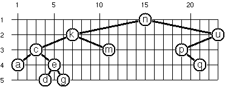

# 99 Scala Problems

These tests are a modified version of [Phil Gold’s list][pgold].

[pgold]: http://aperiodic.net/phil/scala/s-99/

## Writing a solution

Each problem has two files: one for its implementation, the other for its
tests.

The implementation for problem `<N>` is in `src/main/scala/P<N>.scala` while
its tests are in `src/test/scala/P<N>Spec.scala`.

Write your solution as a method on the object `P<N>`. You can anything you like
in the file to answer the problem.

Tests are written with [ScalaTest][scalatest]. Open the
`src/test/scala/P<N>Spec.scala` file, and in the `P<N>Spec` class use the
following syntax:

```scala
"the_name_of_your_method" should "something it should do" in {
  // test code
}

it should "something else it should do" in {
  // test code
}

// more tests
```

Each test can use `assert` to check for expected values:

```scala
assert(some_result == expected_value)
```

Read [ScalaTest’s docs][scalatestdocs] for more info.

[scalatest]: http://www.scalatest.org/user_guide/writing_your_first_test
[scalatestdocs]: http://www.scalatest.org/user_guide/using_assertions

For example, given a problem P00 asking us to write a function `id` which
returns its argument, the `P00.scala` file will look like this:

```scala
package org.p99.scala

object P00 {

  def id[T](something : T) = something

}
```

The `P00Spec.scala` file might look like this:

```scala
package org.p99.scala

import org.scalatest._

class P01Spec extends UnitSpec {

    "id" should "return its argument" in {
        assert(P00.id(42) == 42)
        assert(P00.id(-5) == -5)
    }

    // dummy test to show how to write them
    it should "also return its argument" in {
        assert(P00.id(List()) == List())
    }

    it should "do something else" in {
        // ...
    }
}
```


## Test

Start `sbt` in the project directory:

    $ sbt

Then type `test` to test. You can also use `sbt test` from the command-line but
that’s longer since the JVM has to be started everytime.

Use `test-only org.p99.scala.P00Spec` to test only the problem `00`.

### Problems

### P01 (easy)

Find the last element of a list.

Example:

    scala> last(List(1, 1, 2, 3, 5, 8))
    res0: Int = 8

### P02 (easy)

Find the last but one element of a list.

Example:

    scala> penultimate(List(1, 1, 2, 3, 5, 8))
    res0: Int = 5

### P03 (easy)

Find the Kth element of a list. By convention, the first element in the list is
element 0.

Example:

    scala> nth(2, List(1, 1, 2, 3, 5, 8))
    res0: Int = 2

### P04 (easy)

Find the number of elements of a list.

Example:

    scala> length(List(1, 1, 2, 3, 5, 8))
    res0: Int = 6

### P05 (easy)

Reverse a list.

Example:

    scala> reverse(List(1, 1, 2, 3, 5, 8))
    res0: List[Int] = List(8, 5, 3, 2, 1, 1)

### P06 (easy)

Find out whether a list is a palindrome.

Example:

    scala> isPalindrome(List(1, 2, 3, 2, 1))
    res0: Boolean = true

### P07 (medium)

Flatten a nested list structure.

Example:

    scala> flatten(List(List(1, 1), 2, List(3, List(5, 8))))
    res0: List[Any] = List(1, 1, 2, 3, 5, 8)

### P08 (medium)

Eliminate consecutive duplicates of list elements. If a list contains repeated
elements they should be replaced with a single copy of the element. The order
of the elements should not be changed.

Example:

    scala> compress(List('a, 'a, 'a, 'a, 'b, 'c, 'c, 'a, 'a, 'd, 'e, 'e, 'e, 'e))
    res0: List[Symbol] = List('a, 'b, 'c, 'a, 'd, 'e)

### P09 (medium)

Pack consecutive duplicates of list elements into sublists. If a list contains
repeated elements they should be placed in separate sublists.

Example:

    scala> pack(List('a, 'a, 'a, 'a, 'b, 'c, 'c, 'a, 'a, 'd, 'e, 'e, 'e, 'e))
    res0: List[List[Symbol]] = List(List('a, 'a, 'a, 'a), List('b), List('c, 'c), List('a, 'a), List('d), List('e, 'e, 'e, 'e))

### P10 (easy)

Run-length encoding of a list. Use the result of problem P09 to implement the
so-called run-length encoding data compression method. Consecutive duplicates
of elements are encoded as tuples (N, E) where N is the number of duplicates of
the element E.

Example:

    scala> encode(List('a, 'a, 'a, 'a, 'b, 'c, 'c, 'a, 'a, 'd, 'e, 'e, 'e, 'e))
    res0: List[(Int, Symbol)] = List((4,'a), (1,'b), (2,'c), (2,'a), (1,'d), (4,'e))

### P11 (easy)

Modified run-length encoding. Modify the result of problem P10 in such a way
that if an element has no duplicates it is simply copied into the result list.
Only elements with duplicates are transferred as (N, E) terms.

Example:

    scala> encodeModified(List('a, 'a, 'a, 'a, 'b, 'c, 'c, 'a, 'a, 'd, 'e, 'e, 'e, 'e))
    res0: List[Any] = List((4,'a), 'b, (2,'c), (2,'a), 'd, (4,'e))

### P12 (medium)

Decode a run-length encoded list. Given a run-length code list generated as
specified in problem P10, construct its uncompressed version.

Example:

    scala> decode(List((4, 'a), (1, 'b), (2, 'c), (2, 'a), (1, 'd), (4, 'e)))
    res0: List[Symbol] = List('a, 'a, 'a, 'a, 'b, 'c, 'c, 'a, 'a, 'd, 'e, 'e, 'e, 'e)

### P13 (medium)

Run-length encoding of a list (direct solution). Implement the so-called
run-length encoding data compression method directly. I.e. don't use other
methods you've written (like P09's pack); do all the work directly.

Example:

    scala> encodeDirect(List('a, 'a, 'a, 'a, 'b, 'c, 'c, 'a, 'a, 'd, 'e, 'e, 'e, 'e))
    res0: List[(Int, Symbol)] = List((4,'a), (1,'b), (2,'c), (2,'a), (1,'d), (4,'e))

### P14 (easy)

Duplicate the elements of a list.

Example:

    scala> duplicate(List('a, 'b, 'c, 'c, 'd))
    res0: List[Symbol] = List('a, 'a, 'b, 'b, 'c, 'c, 'c, 'c, 'd, 'd)

### P15 (medium)

Duplicate the elements of a list a given number of times.

Example:

    scala> duplicateN(3, List('a, 'b, 'c, 'c, 'd))
    res0: List[Symbol] = List('a, 'a, 'a, 'b, 'b, 'b, 'c, 'c, 'c, 'c, 'c, 'c, 'd, 'd, 'd)

### P16 (medium)

Drop every Nth element from a list.

Example:

    scala> drop(3, List('a, 'b, 'c, 'd, 'e, 'f, 'g, 'h, 'i, 'j, 'k))
    res0: List[Symbol] = List('a, 'b, 'd, 'e, 'g, 'h, 'j, 'k)

### P17 (easy)

Split a list into two parts. The length of the first part is given. Use a
`Tuple` for your result.

Example:

    scala> split(3, List('a, 'b, 'c, 'd, 'e, 'f, 'g, 'h, 'i, 'j, 'k))
    res0: (List[Symbol], List[Symbol]) = (List('a, 'b, 'c),List('d, 'e, 'f, 'g, 'h, 'i, 'j, 'k))

### P18 (medium)

Extract a slice from a list. Given two indices, I and K, the slice is the list
containing the elements from and including the Ith element up to but not
including the Kth element of the original list. Start counting the elements
with 0.

Example:

    scala> slice(3, 7, List('a, 'b, 'c, 'd, 'e, 'f, 'g, 'h, 'i, 'j, 'k))
    res0: List[Symbol] = List('d, 'e, 'f, 'g)

### P19 (medium)

Rotate a list N places to the left.

Examples:

    scala> rotate(3, List('a, 'b, 'c, 'd, 'e, 'f, 'g, 'h, 'i, 'j, 'k))
    res0: List[Symbol] = List('d, 'e, 'f, 'g, 'h, 'i, 'j, 'k, 'a, 'b, 'c)

    scala> rotate(-2, List('a, 'b, 'c, 'd, 'e, 'f, 'g, 'h, 'i, 'j, 'k))
    res1: List[Symbol] = List('j, 'k, 'a, 'b, 'c, 'd, 'e, 'f, 'g, 'h, 'i)

### P20 (easy)

Remove the Kth element from a list. Return the list and the removed element in
a `Tuple`. Elements are numbered from 0.

Example:

    scala> removeAt(1, List('a, 'b, 'c, 'd))
    res0: (List[Symbol], Symbol) = (List('a, 'c, 'd),'b)

### P21 (easy)

Insert an element at a given position into a list.

Example:

    scala> insertAt('new, 1, List('a, 'b, 'c, 'd))
    res0: List[Symbol] = List('a, 'new, 'b, 'c, 'd)

### P22 (easy)

Create a list containing all integers within a given range.

Example:

    scala> range(4, 9)
    res0: List[Int] = List(4, 5, 6, 7, 8, 9)

### P23 (medium)

Extract a given number of randomly selected elements from a list.

Example:

    scala> randomSelect(3, List('a, 'b, 'c, 'd, 'f, 'g, 'h))
    res0: List[Symbol] = List('e, 'd, 'a)

Hint: Use the solution to problem P20

### P24 (easy)

Lotto: Draw N different random numbers from the set 1..M.

Example:

    scala> lotto(6, 49)
    res0: List[Int] = List(23, 1, 17, 33, 21, 37)

### P25 (easy)

Generate a random permutation of the elements of a list.

Example:

    scala> randomPermute(List('a, 'b, 'c, 'd, 'e, 'f))
    res0: List[Symbol] = List('b, 'a, 'd, 'c, 'e, 'f)

Hint: Use the solution of problem P23.

### P26 (medium)

Generate the combinations of K distinct objects chosen from the N elements of a
list. In how many ways can a committee of 3 be chosen from a group of 12
people? We all know that there are C(12,3) = 220 possibilities (C(N,K) denotes
the well-known binomial coefficient). For pure mathematicians, this result may
be great. But we want to really generate all the possibilities.

Example:

    scala> combinations(3, List('a, 'b, 'c, 'd, 'e, 'f))
    res0: List[List[Symbol]] = List(List('a, 'b, 'c), List('a, 'b, 'd), List('a, 'b, 'e), ...

### P27 (medium)

Group the elements of a set into disjoint subsets.

In how many ways can a group of 9 people work in 3 disjoint subgroups of 2, 3
and 4 persons? Write a function that generates all the possibilities.

Example:

    scala> group3(List("Aldo", "Beat", "Carla", "David", "Evi", "Flip", "Gary", "Hugo", "Ida"))
    res0: List[List[List[String]]] = List(List(List(Aldo, Beat), List(Carla, David, Evi), List(Flip, Gary, Hugo, Ida)), ...

### P28 (medium)

You need to do P27 first.

Generalize the predicate from P27 in a way that we can specify a list of group
sizes and the predicate will return a list of groups.

Example:

    scala> group(List(2, 2, 5), List("Aldo", "Beat", "Carla", "David", "Evi", "Flip", "Gary", "Hugo", "Ida"))
    res0: List[List[List[String]]] = List(List(List(Aldo, Beat), List(Carla, David), List(Evi, Flip, Gary, Hugo, Ida)), ...

Note that we do not want permutations of the group members; i.e.
`((Aldo, Beat), ...)` is the same solution as `((Beat, Aldo), ...)`. However,
we make a difference between `((Aldo, Beat), (Carla, David), ...)` and
`((Carla, David), (Aldo, Beat), ...)`.

You may find more about this combinatorial problem in a good book on discrete mathematics under the term "multinomial coefficients".

### P29 (medium)

Sorting a list of lists according to length of sublists.
We suppose that a list contains elements that are lists themselves. The
objective is to sort the elements of the list according to their length. E.g.
short lists first, longer lists later, or vice versa.

Example:

    scala> lsort(List(List('a, 'b, 'c), List('d, 'e), List('f, 'g, 'h), List('d, 'e), List('i, 'j, 'k, 'l), List('m, 'n), List('o)))
    res0: List[List[Symbol]] = List(List('o), List('d, 'e), List('d, 'e), List('m, 'n), List('a, 'b, 'c), List('f, 'g, 'h), List('i, 'j, 'k, 'l))

### P30 (medium)

You need to do P29 first.

Again, we suppose that a list contains elements that are lists themselves. But
this time the objective is to sort the elements according to their length
frequency; i.e. in the default, sorting is done ascendingly, lists with rare
lengths are placed, others with a more frequent length come later.

Example:

    scala> lsortFreq(List(List('a, 'b, 'c), List('d, 'e), List('f, 'g, 'h), List('d, 'e), List('i, 'j, 'k, 'l), List('m, 'n), List('o)))
    res1: List[List[Symbol]] = List(List('i, 'j, 'k, 'l), List('o), List('a, 'b, 'c), List('f, 'g, 'h), List('d, 'e), List('d, 'e), List('m, 'n))

Note that in the above example, the first two lists in the result have length 4
and 1 and both lengths appear just once. The third and fourth lists have length
3 and there are two list of this length. Finally, the last three lists have
length 2. This is the most frequent length.

### P31 (medium)

Determine whether a given integer number is prime.

Example:

    scala> isPrime(7)
    res0: Boolean = true

### P32 (medium)

Determine the greatest common divisor of two positive integer numbers. Use
Euclid's algorithm.

Example:

    scala> gcd(36, 63)
    res0: Int = 9

### P33 (easy)

Determine whether two positive integer numbers are coprime. Two numbers are
coprime if their greatest common divisor equals 1.

Example:

    scala> isCoprimeTo(35, 64)
    res0: Boolean = true

### P34 (medium)

Calculate Euler's totient function phi(m). Euler's so-called totient function
phi(m) is defined as the number of positive integers r (1 <= r <= m) that are
coprime to m.

Example:

    scala> totient(10)
    res0: Int = 4

### P35 (medium)

Determine the prime factors of a given positive integer. Construct a flat list
containing the prime factors in ascending order.

Example:

    scala> primeFactors(315)
    res0: List[Int] = List(3, 3, 5, 7)

### P36 (medium)

Determine the prime factors of a given positive integer (2). Construct a list
containing the prime factors and their multiplicity.

Example:

    scala> primeFactorMultiplicity(315)
    res0: List[(Int, Int)] = List((3,2), (5,1), (7,1))

Alternately, use a `Map` for the result:

    scala> primeFactorMultiplicity(315)
    res0: Map[Int,Int] = Map(3 -> 2, 5 -> 1, 7 -> 1)

### P37 (medium)

Calculate Euler's totient function phi(m) (improved).
See problem P34 for the definition of Euler's totient function. If the list of
the prime factors of a number m is known in the form of problem P36 then the
function `phi(m>)` can be efficiently calculated as follows:
Let `[[p1, m1], [p2, m2], [p3, m3], ...]` be the list of prime factors (and
their multiplicities) of a given number `m`. Then `phi(m)` can be calculated
with the following formula:

    phi(m) = (p1-1)*p1(m1-1) * (p2-1)*p2(m2-1) * (p3-1)*p3(m3-1) * ...

Note that <cite>a<sup>b</sup></cite> stands for the <cite>b<sup>th</sup></cite>
power of <cite>a</cite>.

### P38 (easy)

Compare the two methods of calculating Euler's totient function. Use the
solutions of problems P34 and P37 to compare the algorithms. Try to calculate
`phi(10090)` as an example.

### P39 (easy)

A list of prime numbers.
Given a range of integers by its lower and upper limit, construct a list of all
prime numbers in that range.

Example:

    scala> listPrimesinRange(7 to 31)
    res0: List[Int] = List(7, 11, 13, 17, 19, 23, 29, 31)

### P40 (medium)

Goldbach's conjecture says that every positive even number greater than 2 is
the sum of two prime numbers. E.g. 28 = 5 + 23. It is one of the most famous
facts in number theory that has not been proved to be correct in the general
case. It has been numerically confirmed up to very large numbers (much larger
than Scala's Int can represent). Write a function to find the two prime numbers
that sum up to a given even integer.

Example:

    scala> goldbach(28)
    res0: (Int, Int) = (5,23)

### P41 (medium)

Given a range of integers by its lower and upper limit, print a list of all
even numbers and their Goldbach composition.

Example:

    scala> printGoldbachList(9 to 20)
    10 = 3 + 7
    12 = 5 + 7
    14 = 3 + 11
    16 = 3 + 13
    18 = 5 + 13
    20 = 3 + 17

In most cases, if an even number is written as the sum of two prime numbers,
one of them is very small. Very rarely, the primes are both bigger than, say,
50. Try to find out how many such cases there are in the range 2..3000.

Example (minimum value of 50 for the primes):

    scala> printGoldbachListLimited(1 to 2000, 50)
    992 = 73 + 919
    1382 = 61 + 1321
    1856 = 67 + 1789
    1928 = 61 + 1867

### P46 (medium)

Define functions `and`, `or`, `nand`, `nor`, `xor`, `impl`, and `equ` (for
logical equivalence) which return `true` or `false` according to the result of
their respective operations; e.g. `and(A, B)` is true if and only if both `A`
and `B` are true.

Example:

    scala> and(true, true)
    res0: Boolean = true

    scala> xor(true. true)
    res1: Boolean = false

A logical expression in two variables can then be written as an function of two
variables, e.g: `(a: Boolean, b: Boolean) => and(or(a, b), nand(a, b))`

### P47 (medium)

You need to do P46 first.

Now, write a function called `table2` which prints the truth table of a given
logical expression in two variables.

Example:

    scala> table2((a: Boolean, b: Boolean) => and(a, or(a, b)))
    A     B     result
    true  true  true
    true  false true
    false true  false
    false false false

### P48 (easy)

Continue problem P46 by redefining and, or, etc as operators. (i.e. make them
methods of a new class with an implicit conversion from `Boolean`.) not will
have to be left as a object method.

    scala> table2((a: Boolean, b: Boolean) => a and (a or not(b)))
    A     B     result
    true  true  true
    true  false true
    false true  false
    false false false

### P49 (medium)

An n-bit Gray code is a sequence of n-bit strings constructed according to
certain rules. For example:

    n = 1: C(1) = ("0", "1").
    n = 2: C(2) = ("00", "01", "11", "10").
    n = 3: C(3) = ("000", "001", "011", "010", "110", "111", "101", "100").

Find out the construction rules and write a function to generate Gray codes.

Example:

    scala> gray(3)
    res0 List[String] = List(000, 001, 011, 010, 110, 111, 101, 100)

See if you can use memoization to make the function more efficient.

### P50 (hard)

First of all, consult a good book on discrete mathematics or algorithms for a
detailed description of Huffman codes!
We suppose a set of symbols with their frequencies, given as a list of `(S, F)`
Tuples. E.g. `(("a", 45), ("b", 13), ("c", 12), ("d", 16), ("e", 9), ("f", 5))`.
Our objective is to construct a list of `(S, C)` Tuples, where `C` is the
Huffman code word for the symbol `S`.

Example:

    scala> huffman(List(("a", 45), ("b", 13), ("c", 12), ("d", 16), ("e", 9), ("f", 5)))
    res0: List[String, String] = List((a,0), (b,101), (c,100), (d,111), (e,1101), (f,1100))

### P51 (medium)

A binary tree is either empty or it is composed of a root element and two
successors, which are binary trees themselves.

We shall use the following classes to represent binary trees. (Also available
in [tree1.scala][tree1].) An `End` is equivalent to an empty tree. A `Branch`
has a value, and two descendant trees. The `toString` functions are relatively
arbitrary, but they yield a more compact output than Scala's default. Putting a
plus in front of the `T` makes the class *covariant*; it will be able to hold
subtypes of whatever type it's created for. (This is important so that `End`
can be a singleton object; as a singleton, it must have a specific type, so we
give it type `Nothing`, which is a subtype of every other type.)


[tree1]: http://aperiodic.net/phil/scala/s-99/tree1.scala

    sealed abstract class Tree[+T]
    case class Node[+T](value: T, left: Tree[T], right: Tree[T]) extends Tree[T] {
        override def toString = "T(" + value.toString + " " + left.toString + " " + right.toString + ")"
    }
    case object End extends Tree[Nothing] {
    override def toString = "."
    }
    object Node {
    def apply[T](value: T): Node[T] = Node(value, End, End)
    }

The example tree above is given by:

    Node('a',
        Node('b', Node('d'), Node('e')),
        Node('c', End, Node('f', Node('g'), End)))

A tree with only a root node would be `Node('a')` and an empty tree would be
`End`.

Write the previous code in a file and ensure it’s well typed.

### P52 (medium)

In a completely balanced binary tree, the following property holds for every
node: The number of nodes in its left subtree and the number of nodes in its
right subtree are almost equal, which means their difference is not greater
than one.
Define an object named `Tree`. Write a function `Tree.cBalanced` to construct
completely balanced binary trees for a given number of nodes. The function
should generate all solutions. The function should take as parameters the
number of nodes and a single value to put in all of them.

Example:

    scala> Tree.cBalanced(4, "x")
    res0: List(Node[String]) = List(T(x T(x . .) T(x . T(x . .))), T(x T(x . .) T(x T(x . .) .)), ...

### P53 (medium)

Let us call a binary tree symmetric if you can draw a vertical line through the
root node and then the right subtree is the mirror image of the left subtree.
Add an `isSymmetric` method to the `Tree` class of P51 to check whether a given
binary tree is symmetric.

Hint: Write an `isMirrorOf` method first to check whether one tree is the
mirror image of another. We are only interested in the structure, not in the
contents of the nodes.

Example:

    scala> Node('a', Node('b'), Node('c')).isSymmetric
    res0: Boolean = true

### P54 (medium)

Write a function to add an element to a binary search tree.

Example:

    scala> End.addValue(2)
    res0: Node[Int] = T(2 . .)

    scala> res0.addValue(3)
    res1: Node[Int] = T(2 . T(3 . .))

    scala> res1.addValue(0)
    res2: Node[Int] = T(2 T(0 . .) T(3 . .))

Hint: The abstract definition of `addValue` in `Tree` should be
`def addValue[U >: T <% Ordered[U]](x: U): Tree[U]`. The `>: T` is because
`addValue`'s parameters need to be contravariant in `T`. (Conceptually, we're
adding nodes above existing nodes. In order for the subnodes to be of type `T`
or any subtype, the upper nodes must be of type `T` or any supertype.) The
`<% Ordered[U]` allows us to use the `<` operator on the values in the tree.

Use that function to construct a binary tree from a list of integers.

    scala> Tree.fromList(List(3, 2, 5, 7, 1))
    res3: Node[Int] = T(3 T(2 T(1 . .) .) T(5 . T(7 . .)))

Finally, use that function to test your solution to P53.

    scala> Tree.fromList(List(5, 3, 18, 1, 4, 12, 21)).isSymmetric
    res4: Boolean = true

    scala> Tree.fromList(List(3, 2, 5, 7, 4)).isSymmetric
    res5: Boolean = false

### P55 (medium)

Apply the generate-and-test paradigm to construct all symmetric, completely
balanced binary trees with a given number of nodes.

    scala> Tree.symmetricBalancedTrees(5, "x")
    res0: List[Node[String]] = List(T(x T(x . T(x . .)) T(x T(x . .) .)), T(x T(x T(x . .) .) T(x . T(x . .))))

### P56 (medium)

In a height-balanced binary tree, the following property holds for every node:
The height of its left subtree and the height of its right subtree are almost
equal, which means their difference is not greater than one.
Write a method `Tree.hbalTrees` to construct height-balanced binary trees for a
given height with a supplied value for the nodes. The function should generate
all solutions.

Example:

    scala> Tree.hbalTrees(3, "x")
    res0: List[Node[String]] = List(T(x T(x T(x . .) T(x . .)) T(x T(x . .) T(x . .))), T(x T(x T(x . .) T(x . .)) T(x T(x . .) .)), ...

### P57 (medium)

Consider a height-balanced binary tree of height H. What is the maximum number
of nodes it can contain? Clearly, MaxN = 2<sup>H</sup> - 1. However, what is
the minimum number MinN? This question is more difficult. Try to find a
recursive statement and turn it into a function `minHbalNodes` that takes a
height and returns MinN.

Example:

    scala> minHbalNodes(3)
    res0: Int = 4

### P58 (medium)

This is a follow-up to P57.

On the other hand, we might ask: what is the maximum height H a height-balanced
binary tree with N nodes can have? Write a `maxHbalHeight` function.

Example:

    scala> maxHbalHeight(4)
    res1: Int = 3

### P59 (medium)

This is a follow-up to P58.

Now, we can attack the main problem: construct all the height-balanced binary
trees with a given number of nodes.

Example:

    scala> Tree.hbalTreesWithNodes(4, "x")
    res2: List[Node[String]] = List(T(x T(x T(x . .) .) T(x . .)), T(x T(x . T(x . .)) T(x . .)), ...

Find out how many height-balanced trees exist for N = 15.

### P60 (easy)

A leaf is a node with no successors. Write a method `leafCount` to count them.

Example:

    scala> Node('x', Node('x'), End).leafCount
    res0: Int = 1

### 61 (easy)

A leaf is a node with no successors. Write a method `leafList` to collect them
in a list.

Example:

    scala> Node('a', Node('b'), Node('c', Node('d'), Node('e'))).leafList
    res0: List[Char] = List(b, d, e)

### P62 (easy)

An internal node of a binary tree has either one or two non-empty successors.
Write a method `internalList` to collect them in a list.

Example:

    scala> Node('a', Node('b'), Node('c', Node('d'), Node('e'))).internalList
    res0: List[Char] = List(a, c)

### P63 (easy)

A node of a binary tree is at level N if the path from the root to the node has
length N-1. The root node is at level 1. Write a method `atLevel` to collect
all nodes at a given level in a list.

Example:

    scala> Node('a', Node('b'), Node('c', Node('d'), Node('e'))).atLevel(2)
    res0: List[Char] = List(b, c)

Using `atLevel` it is easy to construct a method `levelOrder` which creates the
level-order sequence of the nodes. However, there are more efficient ways to do
that.

### P64 (medium)

A complete binary tree with height H is defined as follows: The levels
1,2,3,…,H-1 contain the maximum number of nodes (i.e 2<sup>(i-1)</sup> at the
level i, note that we start counting the levels from 1 at the root). In level
H, which may contain less than the maximum possible number of nodes, all the
nodes are "left-adjusted". This means that in a levelorder tree traversal all
internal nodes come first, the leaves come second, and empty successors (the
`End`s which are not really nodes!) come last. Particularly, complete binary
trees are used as data structures (or addressing schemes) for heaps.

We can assign an address number to each node in a complete binary tree by
enumerating the nodes in levelorder, starting at the root with number 1. In
doing so, we realize that for every node X with address A the following
property holds: The address of X's left and right successors are 2\*A and
2\*A+1, respectively, supposed the successors do exist. This fact can be used
to elegantly construct a complete binary tree structure. Write a method
`completeBinaryTree` that takes as parameters the number of nodes and the value
to put in each node.

Example:

    scala> Tree.completeBinaryTree(6, "x")
    res0: Node[String] = T(x T(x T(x . .) T(x . .)) T(x T(x . .) .))

### P65 (medium)

As a preparation for drawing a tree, a layout algorithm is required to
determine the position of each node in a rectangular grid. Several layout
methods are conceivable, one of them is shown in the illustration below. In
this layout strategy, the position of a node v is obtained by the following two
rules:

* x(v) is equal to the position of the node v in the inorder sequence
* y(v) is equal to the depth of the node v in the tree


In order to store the position of the nodes, we add a new class with the
additional information.

    case class PositionedNode[+T](override val value: T,
        override val left: Tree[T], override val right: Tree[T],
        x: Int, y: Int) extends Node[T](value, left, right) {
      override def toString =
        "T[" + x.toString + "," + y.toString + "]" +
            "(" + value.toString + " " + left.toString + " " + right.toString + ")"
    }

Write a method `layoutBinaryTree` that turns a tree of normal `Node`s into a
tree of `PositionedNode`s.

    scala> Node('a', Node('b', End, Node('c')), Node('d')).layoutBinaryTree
    res0: PositionedNode[Char] = T[3,1](a T[1,2](b . T[2,3](c . .)) T[4,2](d . .))

The pictured tree may be constructed with:

    Tree.fromList(List('n','k','m','c','a','h','g','e','u','p','s','q'))

Use it to check your code.

### P66 (medium)

An alternative layout method is depicted in the illustration below. Find out
the rules and write the corresponding method. Hint: On a given level, the
horizontal distance between neighboring nodes is constant.

Use the same conventions as in problem P65.

Example:

    scala> Node('a', Node('b', End, Node('c')), Node('d')).layoutBinaryTree2
    res0: PositionedNode[Char] = T[3,1]('a T[1,2]('b . T[2,3]('c . .)) T[5,2]('d . .))

The pictured tree may be constructed with:

    Tree.fromList(List('n','k','m','c','a','e','d','g','u','p','q'))

Use it to check your code.



### P67 (hard)

Yet another layout strategy is shown in the illustration below. The method
yields a very compact layout while maintaining a certain symmetry in every
node. Find out the rules and write the corresponding method. Hint: Consider the
horizontal distance between a node and its successor nodes. How tight can you
pack together two subtrees to construct the combined binary tree?

Use the same conventions as in problem P65 and P66. Note: This is a difficult
problem. Don't give up too early!

Example:

    scala> Node('a', Node('b', End, Node('c')), Node('d')).layoutBinaryTree3
    res0: PositionedNode[Char] = T[2,1]('a T[1,2]('b . T[2,3]('c . .)) T[3,2]('d . .))


Which layout do you like most?

### P68 (medium)

Somebody represents binary trees as strings of the following type (see example
below):

    a(b(d,e),c(,f(g,)))


Write a method which generates this string representation, if the tree is given
as usual (in `Node`s and `End`s). Use that method for the `Tree` class's and
subclass's `toString` methods. Then write a method (on the `Tree` object) which
does this inverse; i.e. given the string representation, construct the tree in
the usual form.

For simplicity, suppose the information in the nodes is a single letter and
there are no spaces in the string.

Example:

    scala> Node('a', Node('b', Node('d'), Node('e')), Node('c', End, Node('f', Node('g'), End))).toString
    res0: String = a(b(d,e),c(,f(g,)))

    scala> Tree.fromString("a(b(d,e),c(,f(g,)))")
    res1: Node[Char] = a(b(d,e),c(,f(g,)))

### P69 (medium)

We consider binary trees with nodes that are identified by single lower-case
letters, as in the example of problem P68.

Write methods `preorder` and `inorder` that construct the preorder and inorder
sequence of a given binary tree, respectively. The results should be lists,
e.g. `List('a','b','d','e','c','f','g')` for the preorder sequence of the
example in problem P68.

Example:

    scala> Tree.string2Tree("a(b(d,e),c(,f(g,)))").preorder
    res0: List[Char] = List(a, b, d, e, c, f, g)

    scala> Tree.string2Tree("a(b(d,e),c(,f(g,)))").inorder
    res1: List[Char] = List(d, b, e, a, c, g, f)

### P70 (medium)

This is a follow-up to P69.

If both the preorder sequence and the inorder sequence of the nodes of a binary
tree are given, then the tree is determined unambiguously. Write a method
`preInTree` that does the job.

Example:

    scala> Tree.preInTree(List('a', 'b', 'd', 'e', 'c', 'f', 'g'), List('d', 'b', 'e', 'a', 'c', 'g', 'f'))
    res2: Node[Char] = a(b(d,e),c(,f(g,)))

What happens if the same character appears in more than one node? Try, for
instance, `Tree.preInTree(List('a', 'b', 'a'), List('b', 'a', 'a'))`.

### P71 (medium)

We consider again binary trees with nodes that are identified by single
lower-case letters, as in the example of problem P68. Such a tree can be
represented by the preorder sequence of its nodes in which dots (`.`) are
inserted where an empty subtree (`End`) is encountered during the tree
traversal. For example, the tree shown in problem P68 is represented as
`"abd..e..c.fg..."`. First, try to establish a syntax (BNF or syntax diagrams)
and then write two methods, `toDotstring` and `fromDotstring`, which do the
conversion in both directions.

Example:

    scala> Tree.string2Tree("a(b(d,e),c(,f(g,)))").toDotstring
    res0: String = abd..e..c.fg...

    scala> Tree.fromDotstring("abd..e..c.fg...")
    res1: Node[Char] = a(b(d,e),c(,f(g,)))

### P72 (easy)

A multiway tree is composed of a root element and a (possibly empty) set of
successors which are multiway trees themselves. A multiway tree is never empty.
The set of successor trees is sometimes called a forest.

The code to represent these is somewhat simpler than the code for binary trees,
partly because we don't separate classes for nodes and terminators, and partly
because we don't need the restriction that the value type be ordered.

    case class MTree[+T](value: T, children: List[MTree[T]]) {
        def this(value: T) = this(value, List())
        override def toString = "M(" + value.toString + " {" + children.map(_.toString).mkString(",") + "})"
    }

    object MTree {
        def apply[T](value: T) = new MTree(value, List())
        def apply[T](value: T, children: List[MTree[T]]) = new MTree(value, children)
    }

The example tree is, thus:

    MTree('a', List(MTree('f', List(MTree('g'))), MTree('c'), MTree('b', List(MTree('d'), MTree('e')))))

Write this initial code in a file and ensure it’s well typed.

### P73 (easy)

Write a method `nodeCount` which counts the nodes of a given multiway tree.

Example:

    scala> MTree('a', List(MTree('f'))).nodeCount
    res0: Int = 2

### P74 (medium)

We suppose that the nodes of a multiway tree contain single characters. In the
depth-first order sequence of its nodes, a special character `^` has been
inserted whenever, during the tree traversal, the move is a backtrack to the
previous level.
By this rule, the tree in the figure below is represented as:

    afg^^c^bd^e^^^


Define the syntax of the string and write a function `string2MTree` to
construct an `MTree` from a `String`. Make the function an implicit conversion
from `String`. Write the reverse function, and make it the `toString` method of
`MTree`.

Example:

    scala> MTree('a', List(MTree('f', List(MTree('g'))), MTree('c'), MTree('b', List(MTree('d'), MTree('e'))))).toString
    res0: String = afg^^c^bd^e^^^

### P75 (easy)

We define the internal path length of a multiway tree as the total sum of the
path lengths from the root to all nodes of the tree. By this definition, the
tree in the figure of problem P74 has an internal path length of 9. Write a
method `internalPathLength` to return that sum.

Example:

    scala> "afg^^c^bd^e^^^".internalPathLength
    res0: Int = 9

### P76 (easy)

Write a method `postorder` which constructs the postorder sequence of the nodes
of a multiway tree. The result should be a List.

Example:

    scala> "afg^^c^bd^e^^^".postorder
    res0: List[Char] = List(g, f, c, d, e, b, a)

### P77 (medium)

There is a particular notation for multiway trees in Lisp. Lisp is a prominent
functional programming language. In Lisp almost everything is a list.
Our example tree would be represented in Lisp as `(a (f g) c (b d e))`. The
following pictures give some more examples.


Note that in the "lispy" notation a node with successors (children) in the tree
is always the first element in a list, followed by its children. The "lispy"
representation of a multiway tree is a sequence of atoms and parentheses '('
and ')', with the atoms separated by spaces. We can represent this syntax as a
Scala `String`. Write a method `lispyTree` which constructs a "lispy string"
from an `MTree`.

Example:

    scala> MTree("a", List(MTree("b", List(MTree("c"))))).lispyTree
    res0: String = (a (b c))

As a second, even more interesting, exercise try to write a method that takes a
"lispy" string and turns it into a multiway tree.

### P78 (medium)

A graph is defined as a set of nodes and a set of edges, where each edge is a
pair of nodes.

The class to represent a graph is mutable, which isn't in keeping with pure
functional programming, but a pure functional data structure would make things
much, much more complicated.

Our `Graphs` use an incidence list internally. Each has a list of nodes and a
list of edges. Each node also has a list of edges that connect it to other
nodes. In a directed graph, nodes that are the target of arcs do not have
references to those arcs in their adjacency list.


    abstract class GraphBase[T, U] {
      case class Edge(n1: Node, n2: Node, value: U) {
          def toTuple = (n1.value, n2.value, value)
      }
      case class Node(value: T) {
          var adj: List[Edge] = Nil
          def neighbors: List[Node] = adj.map(edgeTarget(_, this).get)
      }

      var nodes: Map[T, Node] = Map()
      var edges: List[Edge] = Nil

      // If the edge E connects N to another node, returns the other node,
      // otherwise returns None.
      def edgeTarget(e: Edge, n: Node): Option[Node]

      override def equals(o: Any) = o match {
          case g: GraphBase[T,U] => (nodes.keys.toList -- g.nodes.keys.toList == Nil &&
                                  edges.map(_.toTuple) -- g.edges.map(_.toTuple) == Nil)
          case _ => false
      }

      def addNode(value: T) = {
          val n = new Node(value)
          nodes = Map(value -> n) ++ nodes
          n
      }
    }

    class Graph[T, U] extends GraphBase[T, U] {
      override def equals(o: Any) = o match {
          case g: Graph[T,U] => super.equals(g)
          case _ => false
      }

      def edgeTarget(e: Edge, n: Node): Option[Node] =
          if (e.n1 == n) Some(e.n2)
          else if (e.n2 == n) Some(e.n1)
          else None

      def addEdge(n1: T, n2: T, value: U) = {
          val e = new Edge(nodes(n1), nodes(n2), value)
          edges = e :: edges
          nodes(n1).adj = e :: nodes(n1).adj
          nodes(n2).adj = e :: nodes(n2).adj
      }
    }

    class Digraph[T, U] extends GraphBase[T, U] {
      override def equals(o: Any) = o match {
          case g: Digraph[T,U] => super.equals(g)
          case _ => false
      }

      def edgeTarget(e: Edge, n: Node): Option[Node] =
          if (e.n1 == n) Some(e.n2)
          else None

      def addArc(source: T, dest: T, value: U) = {
          val e = new Edge(nodes(source), nodes(dest), value)
          edges = e :: edges
          nodes(source).adj = e :: nodes(source).adj
      }
    }

The full initial Graph code, which also includes objects for creating graphs,
is in [graph1.scala][graph1].

[graph1]: http://aperiodic.net/phil/scala/s-99/graph1.scala

There are a few ways to create a graph from primitives. The <em>graph-term
form</em> lists the nodes and edges separately:

    Graph.term(List('b', 'c', 'd', 'f', 'g', 'h', 'k'),
            List(('b', 'c'), ('b', 'f'), ('c', 'f'), ('f', 'k'), ('g', 'h')))

The <em>adjacency-list</em> form associates each node with its adjacent nodes.
In an undirected graph, care must be taken to ensure that all links are
symmetric — if b is adjacent to c, c must also be adjacent to b.

    Graph.adjacent(List(('b', List('c', 'f')), ('c', List('b', 'f')), ('d', Nil),
                        ('f', List('b', 'c', 'k')), ('g', List('h')), ('h', List('g')),
                        ('k', List('f'))))

The representations we introduced so far are bound to our implementation and
therefore well suited for automated processing, but their syntax is not very
user-friendly. Typing the terms by hand is cumbersome and error-prone. We can
define a more compact and "human-friendly" notation as follows: A graph is
represented by a string of terms of the type X or Y-Z separated by commas. The
standalone terms stand for isolated nodes, the Y-Z terms describe edges. If an
X appears as an endpoint of an edge, it is automatically defined as a node. Our
example could be written as:

    [b-c, f-c, g-h, d, f-b, k-f, h-g]

We call this the <em>human-friendly form</em>. As the example shows, the list
does not have to be sorted and may even contain the same edge multiple times.
Notice the isolated node d.


When the edges of a graph are directed, we call them arcs. These are
represented by ordered pairs. Such a graph is called directed graph. To
represent a directed graph, the forms discussed above are slightly modified.
The example graph opposite is represented as follows:

graph-term form:

    Digraph.term(List('r', 's', 't', 'u', 'v'),
                List(('s', 'r'), ('s', 'u'), ('u', 'r'), ('u', 's'), ('v', 'u')))

adjacency-list form:

    Digraph.adjacent(List(('r', Nil), ('s', List('r', 'u')), ('t', Nil),
                        ('u', List('r', 's')), ('v', List('u'))))

(Note that the adjacency-list form is the same for graphs and digraphs.)

human-friendly form:

    [s>r, t, u>r, s>u, u>s, v>u]

Finally, graphs and digraphs may have additional information attached to nodes
and edges (arcs). For the nodes, this is no problem, as we can put any type
into them. On the other hand, for edges we have to extend our notation. Graphs
with additional information attached to edges are called labeled graphs.

graph-term form:

    Digraph.termLabel(List('k', 'm', 'p', 'q'),
                    List(('m', 'q', 7), ('p', 'm', 5), ('p', 'q', 9)))

adjacency-list form:

    Digraph.adjacentLabel(
    List(('k', Nil), ('m', List(('q', 7))), ('p', List(('m', 5), ('q', 9))),
        ('q', Nil)))

human-friendly form:

    [p>q/9, m>q/7, k, p>m/5]

The notation for labeled graphs can also be used for so-called multi-graphs,
where more than one edge (or arc) is allowed between two given nodes.

### P79 (hard)

Write methods to generate the graph-term and adjacency-list forms from a
`Graph`. Write another method to output the human-friendly form for a graph.
Make it the `toString` method for `Graph`. Write more functions to create
graphs from strings.

Hint: You might need separate functions for labeled and unlabeled graphs.

Example:

    scala> Graph.fromString("[b-c, f-c, g-h, d, f-b, k-f, h-g]").toTermForm
    res0: (List[String], List[(String, String, Unit)]) = (List(d, k, h, c, f, g, b),List((h,g,()), (k,f,()), (f,b,()), (g,h,()), (f,c,()), (b,c,())))

    scala> Digraph.fromStringLabel("[p>q/9, m>q/7, k, p>m/5]").toAdjacentForm
    res1: List[(String, List[(String, Int)])] = List((m,List((q,7))), (p,List((m,5), (q,9))), (k,List()), (q,List()))

### P80 (medium)

Write a method named `findPaths` to find acyclic paths from one node to another
in a graph. The method should return all paths.

Example:

    scala> Digraph.fromStringLabel("[p>q/9, m>q/7, k, p>m/5]").findPaths("p", "q")
    res0: List[List[String]] = List(List(p, q), List(p, m, q))

    scala> Digraph.fromStringLabel("[p>q/9, m>q/7, k, p>m/5]").findPaths("p", "k")
    res1: List[List[String]] = List()

### P81 (easy)

Write a method named `findCycles` to find closed paths (cycles) starting at a
given node in a graph. The method should return all cycles.

Example:

    scala> Graph.fromString("[b-c, f-c, g-h, d, f-b, k-f, h-g]").findCycles("f")
    res0: List[List[String]] = List(List(f, c, b, f), List(f, b, c, f))

### P82 (medium)

Write a method `spanningTrees` to construct all spanning trees of a given
graph. With this method, find out how many spanning trees there are for the
graph depicted below. The data of this example graph can be found below.
When you have a correct solution for the `spanningTrees` method, use it to
define two other useful methods: `isTree` and `isConnected`. Both are
five-minute tasks!


Graph:

    Graph.term(List('a', 'b', 'c', 'd', 'e', 'f', 'g', 'h'),
            List(('a', 'b'), ('a', 'd'), ('b', 'c'), ('b', 'e'),
                    ('c', 'e'), ('d', 'e'), ('d', 'f'), ('d', 'g'),
                    ('e', 'h'), ('f', 'g'), ('g', 'h')))

Example:

    scala> Graph.fromString("[a-b, b-c, a-c]").spanningTrees
    res0: List[Graph[String,Unit]] = List([a-b, b-c], [a-c, b-c], [a-b, a-c])

### P83 (medium)

Write a method `minimalSpanningTree` to construct the minimal spanning tree of
a given labeled graph. Hint: Use Prim's Algorithm. A small modification of the
solution of P82 does the trick. The data of the example graph to the right can
be found below.


Graph:

    Graph.termLabel(
        List('a', 'b', 'c', 'd', 'e', 'f', 'g', 'h'),
            List(('a', 'b', 5), ('a', 'd', 3), ('b', 'c', 2), ('b', 'e', 4),
                    ('c', 'e', 6), ('d', 'e', 7), ('d', 'f', 4), ('d', 'g', 3),
                    ('e', 'h', 5), ('f', 'g', 4), ('g', 'h', 1)))

Example:

    scala> Graph.fromStringLabel("[a-b/1, b-c/2, a-c/3]").minimalSpanningTree
    res0: Graph[String,Int] = [a-b/1, b-c/2]

### P84 (medium)

Two graphs G<sub>1</sub>(N<sub>1</sub>,E<sub>1</sub>) and
G<sub>2</sub>(N<sub>2</sub>,E<sub>2</sub>) are isomorphic if there is a
bijection f: N<sub>1</sub> → N<sub>2</sub> such that for any nodes X,Y of
N<sub>1</sub>, X and Y are adjacent if and only if f(X) and f(Y) are adjacent.

Write a method that determines whether two graphs are isomorphic.

Example:

    scala> Graph.fromString("[a-b]").isIsomorphicTo(Graph.fromString("[5-7]"))
    res0: Boolean = true

### P85 (medium)

1. Write a method `Node.degree` that determines the degree of a given node.
2. Write a method that lists all nodes of a graph sorted according to
   decreasing degree.

Example:

    scala> Graph.fromString("[a-b, b-c, a-c, a-d]").nodes("a").degree
    res0: Int = 3

    scala> Graph.fromString("[a-b, b-c, a-c, a-d]").nodesByDegree
    res1: List[Graph[String,Unit]#Node] = List(Node(a), Node(c), Node(b), Node(d))

### P86 (medium)

Use Welsh-Powell's algorithm to paint the nodes of a graph in such a way that
adjacent nodes have different colors. Make a method `colorNodes` that returns a
list of tuples, each of which contains a node and an integer representing its
color.

Example:

    scala> Graph.fromString("[a-b, b-c, a-c, a-d]").colorNodes
    res2: List[(Graph[String,Unit]#Node,Int)] = List((Node(a),1), (Node(b),2), (Node(c), 3), (Node(d), 2))

### P87 (medium)

Write a method that generates a depth-first order graph traversal sequence. The
starting point should be specified, and the output should be a list of nodes
that are reachable from this starting point (in depth-first order).

Example:

    scala> Graph.fromString("[a-b, b-c, e, a-c, a-d]").nodesByDepthFrom("d")
    res0: List[String] = List(c, b, a, d)

### P88 (medium)

Write a function that splits a graph into its connected components.

Example:

    scala> Graph.fromString("[a-b, c]").splitGraph
    res0: List[Graph[String,Unit]] = List([a-b], [c])

### P89 (medium)

Write a function that determines whether a given graph is bipartite.

Example:

    scala> Digraph.fromString("[a>b, c>a, d>b]").isBipartite
    res0: Boolean = true

    scala> Graph.fromString("[a-b, b-c, c-a]").isBipartite
    res1: Boolean = false

    scala> Graph.fromString("[a-b, b-c, d]").isBipartite
    res2: Boolean = true

    scala> Graph.fromString("[a-b, b-c, d, e-f, f-g, g-e, h]").isBipartite
    res3: Boolean = false

### P90 (medium)

The “eight queens problem” is a classical problem in computer science. The
objective is to place eight queens on a chessboard so that no two queens are
attacking each other; i.e., no two queens are in the same row, the same column,
or on the same diagonal.

Hint: Represent the positions of the queens as a list of numbers `1..N`.
Example: `List(4, 2, 7, 3, 6, 8, 5, 1)` means that the queen in the first
column is in row `4`, the queen in the second column is in row `2`, etc. Use
the [generate-and-test paradigm][gentest].

[gentest]: https://www.siggraph.org/education/materials/HyperVis/concepts/gen_test.htm

### P91 (medium)

Another famous problem is this one: How can a knight jump on an `N×N`
chessboard in such a way that it visits every square exactly once?

Hints: Represent the squares by pairs of their coordinates of the form `(X,
Y)`, where both `X` and `Y` are integers between `1` and `N`. (Alternately,
define a `Point` class for the same purpose.) Write a function
`jumps(N, (X, Y))` to list the squares that a knight can jump to from `(X, Y)`
on a `N×N` chessboard. And finally, represent the solution of our problem as a
list of knight positions (the knight's tour).

It might be nice to find more than one tour, but a computer will take a long
time trying to find them all at once. Can you make a lazy list that only
calculates the tours as needed?

Can you find only "closed tours", where the knight can jump from its final
position back to its starting position?

### P92 (hard)

The Von Koch's conjecture puzzle goes like this: Given a tree with `N` nodes
(and hence `N-1` edges), find a way to enumerate the nodes from `1` to `N` and,
accordingly, the edges from `1` to `N-1` in such a way, that for each edge `K`
the difference of its node numbers is equal to `K`. The conjecture is that this
is always possible.


For small trees the problem is easy to solve by hand. However, for larger
trees, and 14 is already very large, it is extremely difficult to find a
solution. And remember, we don't know for sure whether there is always a
solution!

Write a function that calculates a numbering scheme for a given tree. What is
the solution for the larger tree pictured below?


### P93 (hard)

Given a list of integer numbers, find a correct way of inserting arithmetic
signs (operators) such that the result is a correct equation. Example: With the
list of numbers `List(2,3,5,7,11)` we can form the equations `2-3+5+7 = 11` or
`2 = (3*5+7)/11` (and ten others!).

### P94 (hard)

In a K-regular graph all nodes have a degree of K; i.e. the number of edges
incident in each node is K. How many (non-isomorphic!) 3-regular graphs with 6
nodes are there? See also a [table of results][p94-table] and a
[Java applet][p94-java] that can represent graphs geometrically.

[p94-table]: http://aperiodic.net/phil/scala/s-99/p94.txt
[p94-java]: https://prof.ti.bfh.ch/hew1/informatik3/prolog/p-99/GraphLayout/index.html

### P95 (medium)

On financial documents, like checks, numbers must sometimes be written in full
words. Example: 175 must be written as one-seven-five. Write a function
`fullWords(num: Int)` to print (non-negative) integer numbers in full words.

### P96 (medium)

In a certain programming language (Ada) identifiers are defined by the syntax
diagram (railroad chart) below. Transform the syntax diagram into a system
of syntax diagrams which do not contain loops; i.e. which are purely recursive.
Using these modified diagrams, write a function `isIdentifier` that can check
whether or not a given string is a legal identifier.


### P97 (medium)

Sudoku puzzles go like this:

   Problem statement                 Solution

    .  .  4 | 8  .  . | .  1  7      9  3  4 | 8  2  5 | 6  1  7
            |         |                      |         |
    6  7  . | 9  .  . | .  .  .      6  7  2 | 9  1  4 | 8  5  3
            |         |                      |         |
    5  .  8 | .  3  . | .  .  4      5  1  8 | 6  3  7 | 9  2  4
    --------+---------+--------      --------+---------+--------
    3  .  . | 7  4  . | 1  .  .      3  2  5 | 7  4  8 | 1  6  9
            |         |                      |         |
    .  6  9 | .  .  . | 7  8  .      4  6  9 | 1  5  3 | 7  8  2
            |         |                      |         |
    .  .  1 | .  6  9 | .  .  5      7  8  1 | 2  6  9 | 4  3  5
    --------+---------+--------      --------+---------+--------
    1  .  . | .  8  . | 3  .  6      1  9  7 | 5  8  2 | 3  4  6
            |         |                      |         |
    .  .  . | .  .  6 | .  9  1      8  5  3 | 4  7  6 | 2  9  1
            |         |                      |         |
    2  4  . | .  .  1 | 5  .  .      2  4  6 | 3  9  1 | 5  7  8

Every spot in the puzzle belongs to a (horizontal) row and a (vertical) column,
as well as to one single 3×3 square (which we call "square" for short). At the
beginning, some of the spots carry a single-digit number between 1 and 9. The
problem is to fill the missing spots with digits in such a way that every
number between 1 and 9 appears exactly once in each row, in each column, and in
each square.

### P98 (hard)

Around 1994, a certain kind of puzzles was very popular in England. The "Sunday
Telegraph" newspaper wrote:

> Nonograms are puzzles from Japan and are currently published each week only
> in The Sunday Telegraph. Simply use your logic and skill to complete the grid
> and reveal a picture or diagram.

As a programmer, you are in a better situation: you can have your computer do
the work! Just write a little program ;-).
The puzzle goes like this: Essentially, each row and column of a rectangular
bitmap is annotated with the respective lengths of its distinct strings of
occupied cells. The person who solves the puzzle must complete the bitmap given
only these lengths.

          Problem statement:          Solution:

          |_|_|_|_|_|_|_|_| 3         |_|X|X|X|_|_|_|_| 3
          |_|_|_|_|_|_|_|_| 2 1       |X|X|_|X|_|_|_|_| 2 1
          |_|_|_|_|_|_|_|_| 3 2       |_|X|X|X|_|_|X|X| 3 2
          |_|_|_|_|_|_|_|_| 2 2       |_|_|X|X|_|_|X|X| 2 2
          |_|_|_|_|_|_|_|_| 6         |_|_|X|X|X|X|X|X| 6
          |_|_|_|_|_|_|_|_| 1 5       |X|_|X|X|X|X|X|_| 1 5
          |_|_|_|_|_|_|_|_| 6         |X|X|X|X|X|X|_|_| 6
          |_|_|_|_|_|_|_|_| 1         |_|_|_|_|X|_|_|_| 1
          |_|_|_|_|_|_|_|_| 2         |_|_|_|X|X|_|_|_| 2
           1 3 1 7 5 3 4 3             1 3 1 7 5 3 4 3
           2 1 5 1                     2 1 5 1

For the example above, the problem can be stated as the two lists
`[[3],[2,1],[3,2],[2,2],[6],[1,5],[6],[1],[2]]` and
`[[1,2],[3,1],[1,5],[7,1],[5],[3],[4],[3]]` which give the "solid" lengths of
the rows and columns, top-to-bottom and left-to-right, respectively. Published
puzzles are larger than this example, e.g. 25×20, and apparently always have
unique solutions.

### P99 (hard)

Given an empty (or almost empty) framework of a crossword puzzle and a set of
words. The problem is to place the words into the framework.
The particular crossword puzzle is specified in a text file which first lists
the words (one word per line) in an arbitrary order. Then, after an empty line,
the crossword framework is defined. In this framework specification, an empty
character location is represented by a dot (`.`). In order to make the solution
easier, character locations can also contain predefined character values. The
puzzle below is defined in the file [p99a.dat][p99d1], other examples are
[p99b.dat][p99d2] and [p99d.dat][p99d3]. There is also an example of a puzzle
([p99c.dat][p99d4]) which does not have a solution.

[p99d1]: http://aperiodic.net/phil/scala/s-99/p99a.dat
[p99d2]: http://aperiodic.net/phil/scala/s-99/p99b.dat
[p99d3]: http://aperiodic.net/phil/scala/s-99/p99d.dat
[p99d4]: http://aperiodic.net/phil/scala/s-99/p99c.dat


Words are strings of at least two characters. A horizontal or vertical sequence
of character places in the crossword puzzle framework is called a site. Our
problem is to find a compatible way of placing words onto sites.

Hints:

1. The problem is not easy. You will need some time to thoroughly understand
   it. So, don't give up too early! And remember that the objective is a clean
   solution, not just a quick-and-dirty hack!
2. For efficiency reasons it is important, at least for larger puzzles, to sort
   the words and the sites in a particular order. For this part of the problem,
   the solution of P29 may be very helpful.
