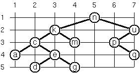
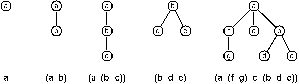
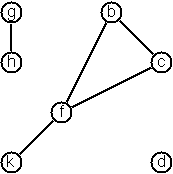
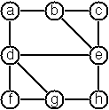

# 99 problèmes en Scala

Cette liste de tests est une version modifiée de [celle de Phil Gold][pgold].

Il reste un peu moins de 25 problèmes non traduits, ceux-ci sont préfixés par
<i>[à traduire]</i>.

[pgold]: http://aperiodic.net/phil/scala/s-99/

## Écrire une solution

Chaque problème a deux fichiers : l’un pour son implémentation, l’autre pour
ses tests.

L’implémentation du problème `<N>` est dans `src/main/scala/P<N>.scala` tandis
que ses tests sont dans `src/test/scala/P<N>Spec.scala`.

Écrivez votre solution dans une méthode sur l’objet `P<N>`. Vous pouvez ajoutez
ce que vous voulez en plus dans chaque fichier pour résoudre les problèmes.

Les tests sont écrits avec [ScalaTest][scalatest]. Ouvrez le fichier
`src/test/scala/P<N>Spec.scala`, et utilisez la syntaxe suivante dans la classe
`P<N>Spec`:

```scala
"le_nom_de_la_methode" should "quelque chose que la methode devrait faire" in {
  // code du test
}

it should "quelque chose d'autre" in {
  // code du test
}

// plus de tests
```

Chaque test peut utiliser `assert` pour vérifier des valeurs attendues :

```scala
assert(un_resultat == une_valeur_attendue)
```

Lisez [la documentation de ScalaTest][scalatestdocs] (en anglais) pour plus
d’informations.

[scalatest]: http://www.scalatest.org/user_guide/writing_your_first_test
[scalatestdocs]: http://www.scalatest.org/user_guide/using_assertions

## Testez

Lancez `sbt` dans le répertoire racine du projet :

    $ sbt

Tapez ensuite `test` pour tester. Vous pouvez aussi utiliser `sbt test`
directement depuis la ligne de commande mais ça prendra plus de temps car il
faut que la JVM soit démarrée à chaque fois.

## Problèmes

### P01 (facile)

Trouvez le dernier élément d’une liste.

Exemple :

    scala> last(List(1, 1, 2, 3, 5, 8))
    res0: Int = 8

### P02 (facile)

Trouvez l’avant-dernier élément d’une liste.

Exemple :

    scala> penultimate(List(1, 1, 2, 3, 5, 8))
    res0: Int = 5

### P03 (facile)

Trouvez le K-ième élément d’une liste. Par convention, le premier élément
commence à 0.

Exemple :

    scala> nth(2, List(1, 1, 2, 3, 5, 8))
    res0: Int = 2

### P04 (facile)

Trouvez le nombre d’éléments d’une liste.

Exemple :

    scala> length(List(1, 1, 2, 3, 5, 8))
    res0: Int = 6

### P05 (facile)

Inversez une liste.

Exemple :

    scala> reverse(List(1, 1, 2, 3, 5, 8))
    res0: List[Int] = List(8, 5, 3, 2, 1, 1)

### P06 (facile)

Déterminez si une liste est un palindrome.

Exemple :

    scala> isPalindrome(List(1, 2, 3, 2, 1))
    res0: Boolean = true

### P07 (moyen)

Désimbriquez une liste.

Exemple :

    scala> flatten(List(List(1, 1), 2, List(3, List(5, 8))))
    res0: List[Any] = List(1, 1, 2, 3, 5, 8)

### P08 (moyen)

Supprimez les éléments consécutifs dupliqués. Si une liste contient plusieurs
éléments égaux répétés, ils doivent êtres remplacés par une seule occurrence de
l’élément. L’ordre des éléments ne doit pas être modifié.

Exemple :

    scala> compress(List('a, 'a, 'a, 'a, 'b, 'c, 'c, 'a, 'a, 'd, 'e, 'e, 'e, 'e))
    res0: List[Symbol] = List('a, 'b, 'c, 'a, 'd, 'e)

### P09 (moyen)

Regroupez les éléments consécutifs dupliqués dans des sous-liste. Si une liste
contient des éléments répétés, ils doivent être placé dans des sous-listes
séparées.

Exemple :

    scala> pack(List('a, 'a, 'a, 'a, 'b, 'c, 'c, 'a, 'a, 'd, 'e, 'e, 'e, 'e))
    res0: List[List[Symbol]] = List(List('a, 'a, 'a, 'a), List('b), List('c, 'c), List('a, 'a), List('d), List('e, 'e, 'e, 'e))

### P10 (facile)

Codage par plage d’une liste : utilisez le résultat du problème P09 pour
implémenter la méthode de compression [par plages][p10-rle]. Les éléments
consécutifs dupliqués sont encodés comme des tuples (N, E), où N est le nombre
d’occurrences de l’élément E.

[p10-rle]: https://fr.wikipedia.org/wiki/Run-length_encoding

Exemple :

    scala> encode(List('a, 'a, 'a, 'a, 'b, 'c, 'c, 'a, 'a, 'd, 'e, 'e, 'e, 'e))
    res0: List[(Int, Symbol)] = List((4,'a), (1,'b), (2,'c), (2,'a), (1,'d), (4,'e))

### P11 (facile)

Codage par plage modifié : modifiez le résultat du problème P10 tel que si un
élément n’est pas dupliqué il est simplement copié dans la liste résultante.
Seuls les éléments dupliqués sont transférés comme des tuples (N, E).

Exemple :

    scala> encodeModified(List('a, 'a, 'a, 'a, 'b, 'c, 'c, 'a, 'a, 'd, 'e, 'e, 'e, 'e))
    res0: List[Any] = List((4,'a), 'b, (2,'c), (2,'a), 'd, (4,'e))

### P12 (moyen)

Décodez une liste telle que celles retournées par la fonction du problème P11.

Exemple :

    scala> decode(List((4, 'a), (1, 'b), (2, 'c), (2, 'a), (1, 'd), (4, 'e)))
    res0: List[Symbol] = List('a, 'a, 'a, 'a, 'b, 'c, 'c, 'a, 'a, 'd, 'e, 'e, 'e, 'e)

### P13 (moyen)

Codage par plage directe : implémentez la méthode de compression décrite dans
le problème P11 directement, c’est-à-dire sans utiliser de méthode déjà écrite
(comme la méthode `pack` du problème P09) : faites tout directement.

Exemple :

    scala> encodeDirect(List('a, 'a, 'a, 'a, 'b, 'c, 'c, 'a, 'a, 'd, 'e, 'e, 'e, 'e))
    res0: List[(Int, Symbol)] = List((4,'a), (1,'b), (2,'c), (2,'a), (1,'d), (4,'e))

### P14 (facile)

Dupliquez les éléments d’une liste.

Exemple :

    scala> duplicate(List('a, 'b, 'c, 'c, 'd))
    res0: List[Symbol] = List('a, 'a, 'b, 'b, 'c, 'c, 'c, 'c, 'd, 'd)

### P15 (moyen)

Dupliquez les éléments d’une liste un nombre donné de fois.

Exemple :

    scala> duplicateN(3, List('a, 'b, 'c, 'c, 'd))
    res0: List[Symbol] = List('a, 'a, 'a, 'b, 'b, 'b, 'c, 'c, 'c, 'c, 'c, 'c, 'd, 'd, 'd)

### P16 (moyen)

Supprimez chaque N-ième élément d’une liste.

Exemple :

    scala> drop(3, List('a, 'b, 'c, 'd, 'e, 'f, 'g, 'h, 'i, 'j, 'k))
    res0: List[Symbol] = List('a, 'b, 'd, 'e, 'g, 'h, 'j, 'k)

### P17 (facile)

Divisez une liste en deux parts, la longueur de la première étant donnée.
Utilisez un `Tuple` pour votre résultat.

Exemple :

    scala> split(3, List('a, 'b, 'c, 'd, 'e, 'f, 'g, 'h, 'i, 'j, 'k))
    res0: (List[Symbol], List[Symbol]) = (List('a, 'b, 'c),List('d, 'e, 'f, 'g, 'h, 'i, 'j, 'k))

### P18 (moyen)

Extrayez une partie d’une liste. Soit deux indices I et K, retournez une
sous-liste comprenant les éléments entre (et incluant) le I-ième et le K-ième
(exclu). Commencez à comptez à 0.

Exemple :

    scala> slice(3, 7, List('a, 'b, 'c, 'd, 'e, 'f, 'g, 'h, 'i, 'j, 'k))
    res0: List[Symbol] = List('d, 'e, 'f, 'g)

### P19 (moyen)

Faites une rotation de liste N fois à gauche.

Exemples:

    scala> rotate(3, List('a, 'b, 'c, 'd, 'e, 'f, 'g, 'h, 'i, 'j, 'k))
    res0: List[Symbol] = List('d, 'e, 'f, 'g, 'h, 'i, 'j, 'k, 'a, 'b, 'c)

    scala> rotate(-2, List('a, 'b, 'c, 'd, 'e, 'f, 'g, 'h, 'i, 'j, 'k))
    res1: List[Symbol] = List('j, 'k, 'a, 'b, 'c, 'd, 'e, 'f, 'g, 'h, 'i)

### P20 (facile)

Supprimez le K-ième élément d’une liste. Retournez la nouvelle liste et
l’élément supprimé dans un `Tuple`. Les éléments sont numérotés à partir de 0.

Exemple :

    scala> removeAt(1, List('a, 'b, 'c, 'd))
    res0: (List[Symbol], Symbol) = (List('a, 'c, 'd),'b)

### P21 (facile)

Insérez un élément à une position donnée dans une liste.

Exemple :

    scala> insertAt('new, 1, List('a, 'b, 'c, 'd))
    res0: List[Symbol] = List('a, 'new, 'b, 'c, 'd)

### P22 (facile)

Créez une liste contenant tous les entiers dans un intervalle donné.

Exemple :

    scala> range(4, 9)
    res0: List[Int] = List(4, 5, 6, 7, 8, 9)

### P23 (moyen)

Extrayez un nombre donné d’élément choisis aléatoirement depuis une liste.

Exemple :

    scala> randomSelect(3, List('a, 'b, 'c, 'd, 'f, 'g, 'h))
    res0: List[Symbol] = List('e, 'd, 'a)

Astuce : utilisez la solution du problème P20.

### P24 (facile)

Loto : Générez N nombres aléatoires différents depuis l’intervalle 1..M.

Exemple :

    scala> lotto(6, 49)
    res0: List[Int] = List(23, 1, 17, 33, 21, 37)

### P25 (facile)

Générez une permutation aléatoire des éléments d’une liste.

Exemple :

    scala> randomPermute(List('a, 'b, 'c, 'd, 'e, 'f))
    res0: List[Symbol] = List('b, 'a, 'd, 'c, 'e, 'f)

Astuce : utilisez la solution du problème P23.

### P26 (moyen)

Générez les combinaisons de K éléments distincts choisis parmi les N éléments
d’une liste. En combien de façons différentes peut-on choisir un comité de 3
personnes dans un groupe de 12 ? Il y a C(12, 3) = 220 possibilités (C(N, K)
représente le coefficient binomial). Pour les mathématiciens, ce résultat peut
être très bien. Mais nous voulons vraiment générer toutes les possibilités.

Exemple :

    scala> combinations(3, List('a, 'b, 'c, 'd, 'e, 'f))
    res0: List[List[Symbol]] = List(List('a, 'b, 'c), List('a, 'b, 'd), List('a, 'b, 'e), ...

### P27 (moyen)

Groupez les éléments d’un ensemble en sous-ensembles disjoints.

En combien de façons différentes peut-on faire travailler un groupe de 9
personnes en trois groupes disjoints de 2, 3 et 4 personnes ? Écrivez une
fonction qui génère toutes les possibilités.

Exemple :

    scala> group3(List("Aldo", "Beat", "Carla", "David", "Evi", "Flip", "Gary", "Hugo", "Ida"))
    res0: List[List[List[String]]] = List(List(List(Aldo, Beat), List(Carla, David, Evi), List(Flip, Gary, Hugo, Ida)), ...

### P28 (moyen)

Généralisez le prédicat du problème P27 de façon à ce qu’on puisse spécifier
une liste de tailles de groupes.

Exemple :

    scala> group(List(2, 2, 5), List("Aldo", "Beat", "Carla", "David", "Evi", "Flip", "Gary", "Hugo", "Ida"))
    res0: List[List[List[String]]] = List(List(List(Aldo, Beat), List(Carla, David), List(Evi, Flip, Gary, Hugo, Ida)), ...

Notez qu’on ne veut pas faire de permutations sur les membres de groupes, i.e.
`((Aldo, Beat), ...)` ne représente pas la même solution que
`((Beat, Aldo), ...)`. Cependant, nous faisons une différence entre
`((Aldo, Beat), (Carla, David), ...)` et `((Carla, David), (Aldo, Beat), ...)`.

### P29 (moyen)

Triez une liste de listes en fonction de la longueur des sous-listes. On
suppose qu’une liste contient des éléments qui sont eux-mêmes des listes.
L’objectif est de trier les éléments de la liste en fonction de leur longueur,
c’est-à-dire avec les courtes listes en premier et les plus longues en dernier,
ou vice-versa.

Exemple :

    scala> lsort(List(List('a, 'b, 'c), List('d, 'e), List('f, 'g, 'h), List('d, 'e), List('i, 'j, 'k, 'l), List('m, 'n), List('o)))
    res0: List[List[Symbol]] = List(List('o), List('d, 'e), List('d, 'e), List('m, 'n), List('a, 'b, 'c), List('f, 'g, 'h), List('i, 'j, 'k, 'l))

### P30 (moyen)

Ce problème est une suite du problème P29. On suppose qu’on a le même type de
liste que défini précédemment, mais cette fois-ci l’objectif est de trier les
éléments par rapport à leur fréquence de longueur, i.e. les listes avec les
longueurs les plus rares sont en premier et celles avec les longueurs les plus
fréquentes sont en dernier.

Exemple :

    scala> lsortFreq(List(List('a, 'b, 'c), List('d, 'e), List('f, 'g, 'h), List('d, 'e), List('i, 'j, 'k, 'l), List('m, 'n), List('o)))
    res1: List[List[Symbol]] = List(List('i, 'j, 'k, 'l), List('o), List('a, 'b, 'c), List('f, 'g, 'h), List('d, 'e), List('d, 'e), List('m, 'n))

Notez que dans l’exemple ci-dessus, les deux premières listes dans le résultat
ont une longueur de 4 et 1, et chacune de ces longueurs n’apparait qu’une fois.
Les troisième et quatrième listes ont une longueur de 3 et il y a deux listes
avec cette longueur. Enfin, les trois dernières ont une longueur de 1, c’est la
longueur la plus fréquente.

### P31 (moyen)

Déterminez si un entier donné est premier.

Exemple :

    scala> isPrime(7)
    res0: Boolean = true

### P32 (moyen)

Déterminez le plus grand diviseur commun (PGCD) de deux entiers positifs
non nuls.
Utilisez l’algorithme d’Euclide.

Exemple :

    scala> gcd(36, 63)
    res0: Int = 9

### P33 (facile)

Vérifiez si deux entiers positifs non nuls sont premiers entre eux. Deux
nombres sont premiers entre eux si leur PGCD vaut 1.

Exemple :

    scala> isCoprimeTo(35, 64)
    res0: Boolean = true

### P34 (moyen)

Calculez la fonction indicatrice d’Euler phi(m). L’indicatrice d’Euler phi(m)
est définie comme le nombre d’entiers positifs r (1 ≤ r ≤ m) qui sont premiers
avec m.

Exemple :

    scala> totient(10)
    res0: Int = 4

### P35 (moyen)

Déterminez les facteurs premiers d’un entier positif non nul donné. Retournez
une liste contenant les facteurs en ordre ascendant.

Exemple :

    scala> primeFactors(315)
    res0: List[Int] = List(3, 3, 5, 7)

### P36 (moyen)

Ce problème est une variante du problème P35 où au lieu de retourner seulement
les facteurs, il faut retourner leur nombre d’occurrences en plus.

Exemple :

    scala> primeFactorMultiplicity(315)
    res0: List[(Int, Int)] = List((3,2), (5,1), (7,1))

De façon alternative, utilisez un `Map` pour le résultat :

    scala> primeFactorMultiplicity(315)
    res0: Map[Int,Int] = Map(3 -> 2, 5 -> 1, 7 -> 1)

### P37 (moyen)

Ce problème est une variante améliorée du problème P34. Lisez-le pour une
définition de l’Indicatrice d’Euler.
Si la liste des facteurs premiers d’un nombre m est connue sous la forme du
problème P36 alors la fonction `phi(m>)` peut être calculé plus efficacement de
la façon suivante :
Soit `[[p1, m1], [p2, m2], [p3, m3], ...]` la liste des facteurs premiers (et
leur nombre d’occurrences) d’un entier donné `m`. Alors `phi(m)` peut être
calculé avec la formule suivante :

    phi(m) = (p1-1)*p1(m1-1) * (p2-1)*p2(m2-1) * (p3-1)*p3(m3-1) * ...

Notez que <cite>a<sup>b</sup></cite> représente la <cite>b<sup>ème</sup></cite>
puissance de <cite>a</cite>.

### P38 (facile)

Comparez les deux méthodes de calcul de l’Indicatrice d’Euler. Utilisez les
solutions des problèmes P34 et P37 pour comparer les algorithmes. Essayez de
calculer `phi(10090)` par exemple.

### P39 (facile)

Construisez la liste de tous les nombres premiers présents dans un intervalle
donné.

Exemple :

    scala> listPrimesinRange(7 to 31)
    res0: List[Int] = List(7, 11, 13, 17, 19, 23, 29, 31)

### P40 (moyen)

La conjecture de Goldbach dit que chaque entier positif pair plus grand que 2
est la somme de deux nombres premiers. Par exemple 28 = 5 + 23. C’est l’un des
faits les plus connus des mathématiques qui n’a pas encore été prouvé dans le
cas général. Il a été confirmé sur des grands nombres (bien plus grands que ce
que le type `Int` de Scala peut représenter). Écrivez une fonction pour trouver
les deux nombres premiers qui composent un entier donné.

Exemple :

    scala> goldbach(28)
    res0: (Int, Int) = (5,23)

### P41 (moyen)

Soit un intervalle d’entiers donnés, affichez une liste de tous les entiers
pairs avec leur composition de Goldbach.

Exemple :

    scala> printGoldbachList(9 to 20)
    10 = 3 + 7
    12 = 5 + 7
    14 = 3 + 11
    16 = 3 + 13
    18 = 5 + 13
    20 = 3 + 17

Dans la plupart des cas, si un entier pair est écrit comme la somme de deux
nombres premiers, l’un d’entre eux est très petit. De façon très rare, les deux
nombres sont plus grands que, par exemple, 50. Essayez de trouver combien il y
a de tel cas dans l’intervalle 2..3000.

Exemple (avec une valeur minimale de 50 pour les nombres premiers) :

    scala> printGoldbachListLimited(1 to 2000, 50)
    992 = 73 + 919
    1382 = 61 + 1321
    1856 = 67 + 1789
    1928 = 61 + 1867

### P46 (moyen)

Définissez les fonctions `and`, `or`, `nand`, `nor`, `xor`, `impl`, and `equ`
(pour l’équivalence logique) qui retournent `true` ou `false` selon le résultat
de leur opération respective, par exemple `and(A, B)` est vrai si et seulement
si `A` et `B` sont tous les deux vrais.

Exemple :

    scala> and(true, true)
    res0: Boolean = true

    scala> xor(true. true)
    res1: Boolean = false

Une expression logique en deux variables peut maintenant être écrite comme une
fonction de deux variables, par exemple :
`(a: Boolean, b: Boolean) => and(or(a, b), nand(a, b))`.

### P47 (moyen)

Vous devez faire le problème P46 avant celui-ci.

Maintenant, écrivez une fonction `table2` qui affiche la table de vérité d’une
expression logique à deux variables donnée.

Exemple :

    scala> table2((a: Boolean, b: Boolean) => and(a, or(a, b)))
    A     B     result
    true  true  true
    true  false true
    false true  false
    false false false

### P48 (facile)

Continuez le problème P46 en redéfinissant `and`, `or`, etc comme opérateurs
(c’est-à-dire en les écrivant comme méthodes d’une nouvelle classe avec une
conversion  implicite depuis `Boolean`). `not` devra être gardé comme une
méthode d’objet.

Exemple :

    scala> table2((a: Boolean, b: Boolean) => a and (a or not(b)))
    A     B     result
    true  true  true
    true  false true
    false true  false
    false false false

### P49 (moyen)

Un code Gray n-bit est une séquence de chaînes à n bits construites à partir de
certaines règles. Par exemple :

    n = 1: C(1) = ("0", "1").
    n = 2: C(2) = ("00", "01", "11", "10").
    n = 3: C(3) = ("000", "001", "011", "010", "110", "111", "101", "100").

Trouvez les règles de construction et écrivez une fonction pour générer ces
codes.

Exemple :

    scala> gray(3)
    res0 List[String] = List(000, 001, 011, 010, 110, 111, 101, 100)

Testez si utiliser la mémoisation permet de rendre la fonction plus rapide.

### P50 (difficile)

Commencez par consulter un bon livre sur les mathématiques discrètes ou les
alhorithmes pour une description détaillée des codes d’Huffman !
On suppose qu’on a un ensemble de symboles avec leur fréquence, donnés comme
une liste de tuples `(S, F)`. Par exemple
`(("a", 45), ("b", 13), ("c", 12), ("d", 16), ("e", 9), ("f", 5))`.
Notre objectif est de construire une liste de tuples `(S, C)`, où `C` est le
code d’Huffman pour le symbole `S`.

Exemple :

    scala> huffman(List(("a", 45), ("b", 13), ("c", 12), ("d", 16), ("e", 9), ("f", 5)))
    res0: List[String, String] = List((a,0), (b,101), (c,100), (d,111), (e,1101), (f,1100))

### P51 (moyen)

Un arbre binaire est soit vide soit composé d’un élément racine et de deux
enfants, qui sont eux-mêmes des arbres binaires.

Nous utiliserons les classes suivantes pour représenter les arbres binaires
(aussi disponibles dans [tree1.scala][tree1]). Un `End` est équivalent à un
arbre vide. Une `Branch` a une valeur et deux arbres enfants. Les fonctions
`toString` sont arbitraires, mais permettent un affichage plus compact que
celui par défaut de Scala. Ajouter un `+` devant le `T` rend la classe
*covariante* : elle pourra supporter plusieurs sous-types du type avec lequel
elle est créée (Ceci est important pour qu’il soit possible d’avoir `End` en
singleton; en tant que singleton il doit avoir un type spécifique, donc nous
lui donnons le type `Nothing`, qui est un sous-type de tous les autres types).


[tree1]: http://aperiodic.net/phil/scala/s-99/tree1.scala

    sealed abstract class Tree[+T]
    case class Node[+T](value: T, left: Tree[T], right: Tree[T]) extends Tree[T] {
        override def toString = "T(" + value.toString + " " + left.toString + " " + right.toString + ")"
    }
    case object End extends Tree[Nothing] {
    override def toString = "."
    }
    object Node {
    def apply[T](value: T): Node[T] = Node(value, End, End)
    }


L’arbre donné en exemple ci-dessus est construit avec :

    Node('a',
        Node('b', Node('d'), Node('e')),
        Node('c', End, Node('f', Node('g'), End)))

Un arbre avec seulement une racine est construit avec `Node('a')` alors qu’un
arbre vide l’est avec `End`.

Écrivez le code précédent dans un fichier en vous assurant qu’il est
correctement typé.

### P52 (moyen)

Dans un arbre binaire équilibré, les propriétés suivantes sont vraies pour tous
les nœuds : le nombre de nœuds dans son sous-arbre gauche est presque égal au
nombre de nœuds dans son sous-arbre droit, ce qui signifie que leur différence
n’est pas plus grande que 1.
Définissez un objet appelé `Tree`. Écrivez une fonction `Tree.cBalanced` pour
construire un arbre binaire complètement balancé pour un nombre donné de nœuds.
La fonction doit générer toutes les solutions. Elle doit prendre en paramètres
le nombre de nœuds ainsi qu’une valeur à donner à chacun d’entre eux.

Exemple :

    scala> Tree.cBalanced(4, "x")
    res0: List(Node[String]) = List(T(x T(x . .) T(x . T(x . .))), T(x T(x . .) T(x T(x . .) .)), ...

### P53 (moyen)

Un arbre binaire est dit symétrique si vous pouvez tracer une ligne vertical au
milieu du nœud racine avec le sous-arbre gauche comme un miroir du sous-arbre
droit.. Ajoutez une méthode `isSymmetric` à la classe `Tree` du problème P51
pour vérifier si un arbre binaire donné est symétrique.

Astuce : Écrivez d’abord une méthode `isMirrorOf` pour vérifier si un arbre est
l’image miroir d’un autre. Nous sommes uniquement intéressés par la structure,
pas le contenu des nœuds.

Exemple :

    scala> Node('a', Node('b'), Node('c')).isSymmetric
    res0: Boolean = true

### P54 (moyen)

Écrivez une fonction pour ajouter un élément à un arbre de recherche binaire.

Exemple :

    scala> End.addValue(2)
    res0: Node[Int] = T(2 . .)

    scala> res0.addValue(3)
    res1: Node[Int] = T(2 . T(3 . .))

    scala> res1.addValue(0)
    res2: Node[Int] = T(2 T(0 . .) T(3 . .))

Astuce : la définition abstraite de `addValue` dans `Tree` devrait être
`def addValue[U >: T <% Ordered[U]](x: U): Tree[U]`. La syntaxe `>: T` est
utilisée ici car les paramètres de `addValue` doivent être des contravariants
de `T` (nous ajoutons des nœuds au dessus d’autres nœuds. Pour que les
sous-nœuds soient de type `T` ou n’importe quel sous-type, les nœuds du dessus
doivent être de type `T` ou d’un sur-type). La syntaxe
`<% Ordered[U]` nous permet d’utiliser l’opérateur `<` sur les values dans
l’arbre.

Utilisez cette fonction pour construire un arbre binaire depuis une liste
d’entiers.

    scala> Tree.fromList(List(3, 2, 5, 7, 1))
    res3: Node[Int] = T(3 T(2 T(1 . .) .) T(5 . T(7 . .)))

Enfin, utilisez cette fonction pour tester votre solution au problème P53.

    scala> Tree.fromList(List(5, 3, 18, 1, 4, 12, 21)).isSymmetric
    res4: Boolean = true

    scala> Tree.fromList(List(3, 2, 5, 7, 4)).isSymmetric
    res5: Boolean = false

### P55 (moyen)

Appliquez le paradigme « generate-and-test » (« générez-et-testez ») pour
construire tous les arbres binaires parfaitement balancés et symétriques qui
ont un nombre de nœuds donné.

Exemple :

    scala> Tree.symmetricBalancedTrees(5, "x")
    res0: List[Node[String]] = List(T(x T(x . T(x . .)) T(x T(x . .) .)), T(x T(x T(x . .) .) T(x . T(x . .))))

### 56 (moyen)

Dans un arbre binaire équilibré, la propriété suivante est vraie pour tous les
nœuds : le nombre de nœuds dans son sous-arbre gauche est presque égal au
nombre de nœuds dans son sous-arbre droit, ce qui signifie que leur différence
n’est pas plus grande que 1.
Écrivez une méthode `Tree.hbalTrees` pour construire les arbres binaires
équilibrés qui ont une hauteur donnée. La méthode prend en arguments la taille
et une valeur à donner à chaque nœud. Elle doit générer toutes les solutions.

Exemple :

    scala> Tree.hbalTrees(3, "x")
    res0: List[Node[String]] = List(T(x T(x T(x . .) T(x . .)) T(x T(x . .) T(x . .))), T(x T(x T(x . .) T(x . .)) T(x T(x . .) .)), ...

### P57 (moyen)

Considérons un arbre binaire équilibré de hauteur H. Quel le nombre maximal de
nœuds qu’il peut contenir ? Clairement, MaxN = 2<sup>H</sup> - 1. Cependant,
quel est le nombre MinN minimum ? La question est plus difficile. Essayez de
trouver une implémentation récursive et utilisez-la pour écrire une fonction
`minHbalNodes` qui prend une taille et retourne `MinN`.

Exemple :

    scala> minHbalNodes(3)
    res0: Int = 4

### P58 (moyen)

Ce problème est la suite du problème P57.

D’un autre côté, nous pouvons nous demander quelle est la taille maximale H
d’un arbre binaire équilibré avec N nœuds. Écrivez une fonction `maxHbalHeight`
pour y répondre.

Exemple :

    scala> maxHbalHeight(4)
    res1: Int = 3

### P59 (moyen)

Ce problème est la suite du problème P58.

Nous pouvons maintenant attaquer le problème principal : construisez tous les
arbres binaires équilibrés avec un nombre donné de nœuds.

Exemple :

    scala> Tree.hbalTreesWithNodes(4, "x")
    res2: List[Node[String]] = List(T(x T(x T(x . .) .) T(x . .)), T(x T(x . T(x . .)) T(x . .)), ...

Trouvez combien d’arbres équilibrés existent pour N = 15.

### P60 (facile)

Une feuille est un nœud sans enfants. Écrivez une méthode `leafCount` pour les
compter.

Exemple :

    scala> Node('x', Node('x'), End).leafCount
    res0: Int = 1

### 61 (facile)

Une feuille est un nœud sans enfants. Écrivez une méthode `leafList` pour les
récupérer dans une liste.

Exemple :

    scala> Node('a', Node('b'), Node('c', Node('d'), Node('e'))).leafList
    res0: List[Char] = List(b, d, e)

### P62 (facile)

Un nœud interne d’arbre binaire a soit un ou deux enfants non-vides. Écrivez
une méthode `internalList` pour les récupérer sous forme de liste.

Exemple :

    scala> Node('a', Node('b'), Node('c', Node('d'), Node('e'))).internalList
    res0: List[Char] = List(a, c)

### P63 (facile)

Un nœud d’arbre binaire est au niveau N si le chemin depuis la racine jusqu’au
nœud a une longueur N-1. La racine est au niveau 1. Écrivez une méthode
`atLevel` pour récupérer tous les nœuds à un niveau donné sous forme de liste.

Exemple :

    scala> Node('a', Node('b'), Node('c', Node('d'), Node('e'))).atLevel(2)
    res0: List[Char] = List(b, c)

Il est facile de construire une méthode `levelOrder` en utilisant `atLevel` qui
crée une séquence de tous les nœuds ordonnés par leur niveau. Il y a aussi des
façons plus efficaces de le faire.

### P64 (moyen)

Un arbre binaire complet de taille H est défini de la façon suivante : les
niveaux 1, 2, 3, …, H-1 contiennent le nombre maximal de nœuds (soit
2<sup>(i-1)</sup> au niveau i, sachant que la racine est au niveau 1). Tous les
nœuds d’un niveau H, qui peut contenir moins que le nombre maximum de nœuds,
sont « alignés à gauche. » Cela signifie que si l’on parcours les nœuds suivant
l’ordre retourné par `levelOrder` (voir problème P63), tous les nœuds internes
viennent en premier, puis les feuilles, puis les enfants vides (les `End`s qui
ne sont pas vraiment des nœuds !). En particulier, les arbres binaires complets
sont utilisés comme structures de données pour les tas.

Nous pouvons assigner un numéro d’adresse à chaque nœud d’un arbre binaire
complet en énumérant les nœuds avec `levelOrder`, en commençant avec 1 pour la
racine. En faisant ça, nous réalisons que pour chaque nœud X avec une adresse A
la propriété suivante s’applique : l’adresse des enfants gauche et droite de X
sont respectivement 2\*A et 2\*A+1, en supposant que ces enfants existent. Ce
fait peut être utilisé pour construire élégamment une structure d’arbre binaire
complet. Écrivez une méthode `completeBinaryTree` qui prend en paramètres le
nombre de nœuds et la valeur à donner à chacun d’eux.

Exemple :

    scala> Tree.completeBinaryTree(6, "x")
    res0: Node[String] = T(x T(x T(x . .) T(x . .)) T(x T(x . .) .))

### [à traduire] P65 (moyen)

As a preparation for drawing a tree, a layout algorithm is required to
determine the position of each node in a rectangular grid. Several layout
methods are conceivable, one of them is shown in the illustration below. In
this layout strategy, the position of a node v is obtained by the following two
rules:

* x(v) is equal to the position of the node v in the inorder sequence
* y(v) is equal to the depth of the node v in the tree


In order to store the position of the nodes, we add a new class with the
additional information.

    case class PositionedNode[+T](override val value: T,
        override val left: Tree[T], override val right: Tree[T],
        x: Int, y: Int) extends Node[T](value, left, right) {
      override def toString =
        "T[" + x.toString + "," + y.toString + "]" +
            "(" + value.toString + " " + left.toString + " " + right.toString + ")"
    }

Write a method `layoutBinaryTree` that turns a tree of normal `Node`s into a
tree of `PositionedNode`s.

    scala> Node('a', Node('b', End, Node('c')), Node('d')).layoutBinaryTree
    res0: PositionedNode[Char] = T[3,1](a T[1,2](b . T[2,3](c . .)) T[4,2](d . .))

The pictured tree may be constructed with:

    Tree.fromList(List('n','k','m','c','a','h','g','e','u','p','s','q'))

Use it to check your code.

### P66 (moyen)

Une mise en forme alternative est montrée dans l’illustration ci-dessous.
Trouvez les règles et écrivez la méthode correspondante. Astuce : à un niveau
donné, la distance horizontale entre les nœuds voisins est constante.


Utilisez les mêmes conventions que dans le problème P65.

Exemple :

    scala> Node('a', Node('b', End, Node('c')), Node('d')).layoutBinaryTree2
    res0: PositionedNode[Char] = T[3,1]('a T[1,2]('b . T[2,3]('c . .)) T[5,2]('d . .))

L’arbre de l’image peut être construit avec :

    Tree.fromList(List('n','k','m','c','a','e','d','g','u','p','q'))

Utilisez-le pour vérifier votre code.

### [à traduire] P67 (difficile)

Yet another layout strategy is shown in the illustration below. The method
yields a very compact layout while maintaining a certain symmetry in every
node. Find out the rules and write the corresponding method. Hint: Consider the
horizontal distance between a node and its successor nodes. How tight can you
pack together two subtrees to construct the combined binary tree?

Use the same conventions as in problem P65 and P66. Note: This is a difficult
problem. Don't give up too early!

Exemple :

    scala> Node('a', Node('b', End, Node('c')), Node('d')).layoutBinaryTree3
    res0: PositionedNode[Char] = T[2,1]('a T[1,2]('b . T[2,3]('c . .)) T[3,2]('d . .))



Which layout do you like most?

### [à traduire] P68 (moyen)

Somebody represents binary trees as strings of the following type (see example
below):

    a(b(d,e),c(,f(g,)))


Write a method which generates this string representation, if the tree is given
as usual (in `Node`s and `End`s). Use that method for the `Tree` class's and
subclass's `toString` methods. Then write a method (on the `Tree` object) which
does this inverse; i.e. given the string representation, construct the tree in
the usual form.

For simplicity, suppose the information in the nodes is a single letter and
there are no spaces in the string.

Exemple :

    scala> Node('a', Node('b', Node('d'), Node('e')), Node('c', End, Node('f', Node('g'), End))).toString
    res0: String = a(b(d,e),c(,f(g,)))

    scala> Tree.fromString("a(b(d,e),c(,f(g,)))")
    res1: Node[Char] = a(b(d,e),c(,f(g,)))

### [à traduire] P69 (moyen)

We consider binary trees with nodes that are identified by single lower-case
letters, as in the example of problem P68.

Write methods `preorder` and `inorder` that construct the preorder and inorder
sequence of a given binary tree, respectively. The results should be lists,
e.g. `List('a','b','d','e','c','f','g')` for the preorder sequence of the
example in problem P68.

Exemple :

    scala> Tree.string2Tree("a(b(d,e),c(,f(g,)))").preorder
    res0: List[Char] = List(a, b, d, e, c, f, g)

    scala> Tree.string2Tree("a(b(d,e),c(,f(g,)))").inorder
    res1: List[Char] = List(d, b, e, a, c, g, f)

### [à traduire] P70 (moyen)

This is a follow-up to P69.

If both the preorder sequence and the inorder sequence of the nodes of a binary
tree are given, then the tree is determined unambiguously. Write a method
`preInTree` that does the job.

Exemple :

    scala> Tree.preInTree(List('a', 'b', 'd', 'e', 'c', 'f', 'g'), List('d', 'b', 'e', 'a', 'c', 'g', 'f'))
    res2: Node[Char] = a(b(d,e),c(,f(g,)))

What happens if the same character appears in more than one node? Try, for
instance, `Tree.preInTree(List('a', 'b', 'a'), List('b', 'a', 'a'))`.

### [à traduire] P71 (moyen)

We consider again binary trees with nodes that are identified by single
lower-case letters, as in the example of problem P68. Such a tree can be
represented by the preorder sequence of its nodes in which dots (`.`) are
inserted where an empty subtree (`End`) is encountered during the tree
traversal. For example, the tree shown in problem P68 is represented as
`"abd..e..c.fg..."`. First, try to establish a syntax (BNF or syntax diagrams)
and then write two methods, `toDotstring` and `fromDotstring`, which do the
conversion in both directions.

Exemple :

    scala> Tree.string2Tree("a(b(d,e),c(,f(g,)))").toDotstring
    res0: String = abd..e..c.fg...

    scala> Tree.fromDotstring("abd..e..c.fg...")
    res1: Node[Char] = a(b(d,e),c(,f(g,)))

### [à traduire] P72 (facile)

A multiway tree is composed of a root element and a (possibly empty) set of
successors which are multiway trees themselves. A multiway tree is never empty.
The set of successor trees is sometimes called a forest.

The code to represent these is somewhat simpler than the code for binary trees,
partly because we don't separate classes for nodes and terminators, and partly
because we don't need the restriction that the value type be ordered.

    case class MTree[+T](value: T, children: List[MTree[T]]) {
        def this(value: T) = this(value, List())
        override def toString = "M(" + value.toString + " {" + children.map(_.toString).mkString(",") + "})"
    }

    object MTree {
        def apply[T](value: T) = new MTree(value, List())
        def apply[T](value: T, children: List[MTree[T]]) = new MTree(value, children)
    }

The example tree is, thus:

    MTree('a', List(MTree('f', List(MTree('g'))), MTree('c'), MTree('b', List(MTree('d'), MTree('e')))))

Write this initial code in a file and ensure it’s well typed.

### P73 (facile)

Écrivez une méthode `nodeCount` qui compte les nœuds d’un arbre donné.

Exemple :

    scala> MTree('a', List(MTree('f'))).nodeCount
    res0: Int = 2

### [à traduire] P74 (moyen)

We suppose that the nodes of a multiway tree contain single characters. In the
depth-first order sequence of its nodes, a special character `^` has been
inserted whenever, during the tree traversal, the move is a backtrack to the
previous level.
By this rule, the tree in the figure below is represented as:

    afg^^c^bd^e^^^


Define the syntax of the string and write a function `string2MTree` to
construct an `MTree` from a `String`. Make the function an implicit conversion
from `String`. Write the reverse function, and make it the `toString` method of
`MTree`.

Exemple :

    scala> MTree('a', List(MTree('f', List(MTree('g'))), MTree('c'), MTree('b', List(MTree('d'), MTree('e'))))).toString
    res0: String = afg^^c^bd^e^^^

### [à traduire] P75 (facile)

We define the internal path length of a multiway tree as the total sum of the
path lengths from the root to all nodes of the tree. By this definition, the
tree in the figure of problem P74 has an internal path length of 9. Write a
method `internalPathLength` to return that sum.

Exemple :

    scala> "afg^^c^bd^e^^^".internalPathLength
    res0: Int = 9

### [à traduire] P76 (facile)

Write a method `postorder` which constructs the postorder sequence of the nodes
of a multiway tree. The result should be a List.

Exemple :

    scala> "afg^^c^bd^e^^^".postorder
    res0: List[Char] = List(g, f, c, d, e, b, a)

### [à traduire] P77 (moyen)

There is a particular notation for multiway trees in Lisp. Lisp is a prominent
functional programming language. In Lisp almost everything is a list.
Our example tree would be represented in Lisp as `(a (f g) c (b d e))`. The
following pictures give some more examples.



Note that in the "lispy" notation a node with successors (children) in the tree
is always the first element in a list, followed by its children. The "lispy"
representation of a multiway tree is a sequence of atoms and parentheses '('
and ')', with the atoms separated by spaces. We can represent this syntax as a
Scala `String`. Write a method `lispyTree` which constructs a "lispy string"
from an `MTree`.

Exemple :

    scala> MTree("a", List(MTree("b", List(MTree("c"))))).lispyTree
    res0: String = (a (b c))

As a second, even more interesting, exercise try to write a method that takes a
"lispy" string and turns it into a multiway tree.

### [à traduire] P78 (moyen)

A graph is defined as a set of nodes and a set of edges, where each edge is a
pair of nodes.

The class to represent a graph is mutable, which isn't in keeping with pure
functional programming, but a pure functional data structure would make things
much, much more complicated.

Our `Graphs` use an incidence list internally. Each has a list of nodes and a
list of edges. Each node also has a list of edges that connect it to other
nodes. In a directed graph, nodes that are the target of arcs do not have
references to those arcs in their adjacency list.



    abstract class GraphBase[T, U] {
      case class Edge(n1: Node, n2: Node, value: U) {
          def toTuple = (n1.value, n2.value, value)
      }
      case class Node(value: T) {
          var adj: List[Edge] = Nil
          def neighbors: List[Node] = adj.map(edgeTarget(_, this).get)
      }

      var nodes: Map[T, Node] = Map()
      var edges: List[Edge] = Nil

      // If the edge E connects N to another node, returns the other node,
      // otherwise returns None.
      def edgeTarget(e: Edge, n: Node): Option[Node]

      override def equals(o: Any) = o match {
          case g: GraphBase[T,U] => (nodes.keys.toList -- g.nodes.keys.toList == Nil &&
                                  edges.map(_.toTuple) -- g.edges.map(_.toTuple) == Nil)
          case _ => false
      }

      def addNode(value: T) = {
          val n = new Node(value)
          nodes = Map(value -> n) ++ nodes
          n
      }
    }

    class Graph[T, U] extends GraphBase[T, U] {
      override def equals(o: Any) = o match {
          case g: Graph[T,U] => super.equals(g)
          case _ => false
      }

      def edgeTarget(e: Edge, n: Node): Option[Node] =
          if (e.n1 == n) Some(e.n2)
          else if (e.n2 == n) Some(e.n1)
          else None

      def addEdge(n1: T, n2: T, value: U) = {
          val e = new Edge(nodes(n1), nodes(n2), value)
          edges = e :: edges
          nodes(n1).adj = e :: nodes(n1).adj
          nodes(n2).adj = e :: nodes(n2).adj
      }
    }

    class Digraph[T, U] extends GraphBase[T, U] {
      override def equals(o: Any) = o match {
          case g: Digraph[T,U] => super.equals(g)
          case _ => false
      }

      def edgeTarget(e: Edge, n: Node): Option[Node] =
          if (e.n1 == n) Some(e.n2)
          else None

      def addArc(source: T, dest: T, value: U) = {
          val e = new Edge(nodes(source), nodes(dest), value)
          edges = e :: edges
          nodes(source).adj = e :: nodes(source).adj
      }
    }

The full initial Graph code, which also includes objects for creating graphs,
is in [graph1.scala][graph1].

[graph1]: http://aperiodic.net/phil/scala/s-99/graph1.scala

There are a few ways to create a graph from primitives. The <em>graph-term
form</em> lists the nodes and edges separately:

    Graph.term(List('b', 'c', 'd', 'f', 'g', 'h', 'k'),
            List(('b', 'c'), ('b', 'f'), ('c', 'f'), ('f', 'k'), ('g', 'h')))

The <em>adjacency-list</em> form associates each node with its adjacent nodes.
In an undirected graph, care must be taken to ensure that all links are
symmetric — if b is adjacent to c, c must also be adjacent to b.

    Graph.adjacent(List(('b', List('c', 'f')), ('c', List('b', 'f')), ('d', Nil),
                        ('f', List('b', 'c', 'k')), ('g', List('h')), ('h', List('g')),
                        ('k', List('f'))))

The representations we introduced so far are bound to our implementation and
therefore well suited for automated processing, but their syntax is not very
user-friendly. Typing the terms by hand is cumbersome and error-prone. We can
define a more compact and "human-friendly" notation as follows: A graph is
represented by a string of terms of the type X or Y-Z separated by commas. The
standalone terms stand for isolated nodes, the Y-Z terms describe edges. If an
X appears as an endpoint of an edge, it is automatically defined as a node. Our
example could be written as:

    [b-c, f-c, g-h, d, f-b, k-f, h-g]

We call this the <em>human-friendly form</em>. As the example shows, the list
does not have to be sorted and may even contain the same edge multiple times.
Notice the isolated node d.


When the edges of a graph are directed, we call them arcs. These are
represented by ordered pairs. Such a graph is called directed graph. To
represent a directed graph, the forms discussed above are slightly modified.
The example graph opposite is represented as follows:

graph-term form:

    Digraph.term(List('r', 's', 't', 'u', 'v'),
                List(('s', 'r'), ('s', 'u'), ('u', 'r'), ('u', 's'), ('v', 'u')))

adjacency-list form:

    Digraph.adjacent(List(('r', Nil), ('s', List('r', 'u')), ('t', Nil),
                        ('u', List('r', 's')), ('v', List('u'))))

(Note that the adjacency-list form is the same for graphs and digraphs.)

human-friendly form:

    [s>r, t, u>r, s>u, u>s, v>u]

Finally, graphs and digraphs may have additional information attached to nodes
and edges (arcs). For the nodes, this is no problem, as we can put any type
into them. On the other hand, for edges we have to extend our notation. Graphs
with additional information attached to edges are called labeled graphs.

graph-term form:

    Digraph.termLabel(List('k', 'm', 'p', 'q'),
                    List(('m', 'q', 7), ('p', 'm', 5), ('p', 'q', 9)))

adjacency-list form:

    Digraph.adjacentLabel(
    List(('k', Nil), ('m', List(('q', 7))), ('p', List(('m', 5), ('q', 9))),
        ('q', Nil)))

human-friendly form:

    [p>q/9, m>q/7, k, p>m/5]

The notation for labeled graphs can also be used for so-called multi-graphs,
where more than one edge (or arc) is allowed between two given nodes.

### [à traduire] P79 (difficile)

Write methods to generate the graph-term and adjacency-list forms from a
`Graph`. Write another method to output the human-friendly form for a graph.
Make it the `toString` method for `Graph`. Write more functions to create
graphs from strings.

Astuce : Vous aurez peut-être besoin d’utiliser des fonctions séparées pour les
graphes labellés et non-labellés.

Exemple :

    scala> Graph.fromString("[b-c, f-c, g-h, d, f-b, k-f, h-g]").toTermForm
    res0: (List[String], List[(String, String, Unit)]) = (List(d, k, h, c, f, g, b),List((h,g,()), (k,f,()), (f,b,()), (g,h,()), (f,c,()), (b,c,())))

    scala> Digraph.fromStringLabel("[p>q/9, m>q/7, k, p>m/5]").toAdjacentForm
    res1: List[(String, List[(String, Int)])] = List((m,List((q,7))), (p,List((m,5), (q,9))), (k,List()), (q,List()))

### P80 (moyen)

Écrivez une méthode `findPaths` pour trouver les chemins acycliques depuis un
nœud vers un autre dans un graphe. La méthode doit retourner tous les chemins.

Exemple :

    scala> Digraph.fromStringLabel("[p>q/9, m>q/7, k, p>m/5]").findPaths("p", "q")
    res0: List[List[String]] = List(List(p, q), List(p, m, q))

    scala> Digraph.fromStringLabel("[p>q/9, m>q/7, k, p>m/5]").findPaths("p", "k")
    res1: List[List[String]] = List()

### P81 (facile)

Écrivez une méthode `findCycles` pour trouver les chemins fermés (cycles) qui
commencent à un nœud donné dans un graphe. La méthode doit retourner tous les
cycles.

Exemple :

    scala> Graph.fromString("[b-c, f-c, g-h, d, f-b, k-f, h-g]").findCycles("f")
    res0: List[List[String]] = List(List(f, c, b, f), List(f, b, c, f))

### [à traduire] P82 (moyen)

Write a method `spanningTrees` to construct all spanning trees of a given
graph. With this method, find out how many spanning trees there are for the
graph depicted to the right. The data of this example graph can be found below.
When you have a correct solution for the `spanningTrees` method, use it to
define two other useful methods: `isTree` and `isConnected`. Both are
five-minute tasks!



Graph:

    Graph.term(List('a', 'b', 'c', 'd', 'e', 'f', 'g', 'h'),
            List(('a', 'b'), ('a', 'd'), ('b', 'c'), ('b', 'e'),
                    ('c', 'e'), ('d', 'e'), ('d', 'f'), ('d', 'g'),
                    ('e', 'h'), ('f', 'g'), ('g', 'h')))

Exemple :

    scala> Graph.fromString("[a-b, b-c, a-c]").spanningTrees
    res0: List[Graph[String,Unit]] = List([a-b, b-c], [a-c, b-c], [a-b, a-c])

### [à traduire] P83 (moyen)

Write a method `minimalSpanningTree` to construct the minimal spanning tree of
a given labeled graph. Hint: Use Prim's Algorithm. A small modification of the
solution of P83 does the trick. The data of the example graph to the right can
be found below.


Graph:

    Graph.termLabel(
    List('a', 'b', 'c', 'd', 'e', 'f', 'g', 'h'),
        List(('a', 'b', 5), ('a', 'd', 3), ('b', 'c', 2), ('b', 'e', 4),
                ('c', 'e', 6), ('d', 'e', 7), ('d', 'f', 4), ('d', 'g', 3),
                ('e', 'h', 5), ('f', 'g', 4), ('g', 'h', 1)))

Exemple :

    scala> Graph.fromStringLabel("[a-b/1, b-c/2, a-c/3]").minimalSpanningTree
    res0: Graph[String,Int] = [a-b/1, b-c/2]

### P84 (moyen)

Deux graphes G<sub>1</sub>(N<sub>1</sub>,E<sub>1</sub>) et
G<sub>2</sub>(N<sub>2</sub>,E<sub>2</sub>) sont isomorphiques si il y a une
bijection f: N<sub>1</sub> → N<sub>2</sub> telle que pour n’importe quels
nœuds X, Y de N<sub>1</sub>, X et Y sont adjacents si et seulement si f(X) et f(Y) sont adjacents.

Écrivez une méthode qui détermine si deux graphes sont isomorphiques.

Exemple :

    scala> Graph.fromString("[a-b]").isIsomorphicTo(Graph.fromString("[5-7]"))
    res0: Boolean = true

### P85 (moyen)

1. Écrivez une méthode `Node.degree` qui détermine le degré d’un nœud donné.
2. Écrivez une méthode qui liste tous les nœuds d’un graphe triés selon leur
   degré, du plus haut au plus bas.

Exemple :

    scala> Graph.fromString("[a-b, b-c, a-c, a-d]").nodes("a").degree
    res0: Int = 3

    scala> Graph.fromString("[a-b, b-c, a-c, a-d]").nodesByDegree
    res1: List[Graph[String,Unit]#Node] = List(Node(a), Node(c), Node(b), Node(d))

### P86 (moyen)

Utilisez l’algorithme de Welsh-Powell pour peindre les nœuds d’un graphe tels
que tous les nœuds adjacents ont des couleurs différentes. Ajoutez une méthode
`colorNodes` qui retourne une liste de tuples, chacun contenant un nœud et un
entier représentant sa couleur.

Exemple :

    scala> Graph.fromString("[a-b, b-c, a-c, a-d]").colorNodes
    res2: List[(Graph[String,Unit]#Node,Int)] = List((Node(a),1), (Node(b),2), (Node(c), 3), (Node(d), 2))

### [à traduire] P87 (moyen)

Write a method that generates a depth-first order graph traversal sequence. The
starting point should be specified, and the output should be a list of nodes
that are reachable from this starting point (in depth-first order).

Exemple :

    scala> Graph.fromString("[a-b, b-c, e, a-c, a-d]").nodesByDepthFrom("d")
    res0: List[String] = List(c, b, a, d)

### P88 (moyen)

Écrivez une fonction qui sépare les composants connectés d’un graph.

Exemple :

    scala> Graph.fromString("[a-b, c]").splitGraph
    res0: List[Graph[String,Unit]] = List([a-b], [c])

### P89 (moyen)

Écrivez une fonction qui détermine si un graph donné est biparti.

Exemple :

    scala> Digraph.fromString("[a>b, c>a, d>b]").isBipartite
    res0: Boolean = true

    scala> Graph.fromString("[a-b, b-c, c-a]").isBipartite
    res1: Boolean = false

    scala> Graph.fromString("[a-b, b-c, d]").isBipartite
    res2: Boolean = true

    scala> Graph.fromString("[a-b, b-c, d, e-f, f-g, g-e, h]").isBipartite
    res3: Boolean = false

### P90 (moyen)

Le problème des « huits reines » est un problème classique en informatique.
L’objectif est de placer huit reines sur un échiquier telles que deux reines ne
s’attaquent pas entre elles, c’est-à-dire que deux reines ne sont jamais sur la
même ligne, colonne ou diagonale.

Astuce : Représentez les positions des reines comme une liste de nombres
`1..N`. Par exemple `List(4, 2, 7, 3, 6, 8, 5, 1)` signifie que la reine dans
la première colonne est sur la ligne 4, la reine dans la seconde colonne est
sur la ligne 2, etc. Utilisez le paradigme « [générez-et-testez][gentest]. »

[gentest]: https://www.siggraph.org/education/materials/HyperVis/concepts/gen_test.htm

### [à traduire] P91 (moyen)

Another famous problem is this one: How can a knight jump on an `NÃ-N`
chessboard in such a way that it visits every square exactly once?

Hints: Represent the squares by pairs of their coordinates of the form `(X,
Y)`, where both `X` and `Y` are integers between `1` and `N`. (Alternately,
define a `Point` class for the same purpose.) Write a function
`jumps(N, (X, Y))` to list the squares that a knight can jump to from `(X, Y)`
on a `NÃ-N` chessboard. And finally, represent the solution of our problem as a
list of knight positions (the knight's tour).

It might be nice to find more than one tour, but a computer will take a long
time trying to find them all at once. Can you make a lazy list that only
calculates the tours as needed?

Can you find only "closed tours", where the knight can jump from its final
position back to its starting position?

### [à traduire] P92 (difficile)

The Von Koch's conjecture puzzle goes like this: Given a tree with `N` nodes
(and hence `N-1` edges), find a way to enumerate the nodes from `1` to `N` and,
accordingly, the edges from `1` to `N-1` in such a way, that for each edge `K`
the difference of its node numbers is equal to `K`. The conjecture is that this
is always possible.


For small trees the problem is easy to solve by hand. However, for larger
trees, and 14 is already very large, it is extremely difficult to find a
solution. And remember, we don't know for sure whether there is always a
solution!

Write a function that calculates a numbering scheme for a given tree. What is
the solution for the larger tree pictured below?


### P93 (difficile)

Soit une liste de nombres entiers donnée, trouvez une façon correcte d’insérer
des symboles arithmétiques (opérateurs) tels que le résultat soit une équation
correcte. Par exemple, avec la liste de nombres `List(2,3,5,7,11)`, nous
pouvons former les équations `2-3+5+7 = 11` ou `2 = (3*5+7)/11` (et dix autres
!).

### [à traduire] P94 (difficile)

In a K-regular graph all nodes have a degree of K; i.e. the number of edges
incident in each node is K. How many (non-isomorphic!) 3-regular graphs with 6
nodes are there? See also a [table of results][p94-table] and a
[Java applet][p94-java] that can represent graphs geometrically.

[p94-table]: http://aperiodic.net/phil/scala/s-99/p94.txt
[p94-java]: https://prof.ti.bfh.ch/hew1/informatik3/prolog/p-99/GraphLayout/index.html

### P95 (moyen)

Les documents financiers tels que les chèques requièrent parfois que les
nombres soient écrits en français. Par exemple, 175 doit être écrit « cent
soixante-quinze. » Écrivez une fonction `fullWords(num: Int)` pour afficher les
entiers (positifs) en français.

### [à traduire] P96 (moyen)

In a certain programming language (Ada) identifiers are defined by the syntax
diagram (railroad chart) below. Transform the syntax diagram into a system
of syntax diagrams which do not contain loops; i.e. which are purely recursive.
Using these modified diagrams, write a function `isIdentifier` that can check
whether or not a given string is a legal identifier.


### [à traduire] P97 (moyen)

Les puzzles de Sudoku ressemblent à la figure suivante :

   Problème                          Solution

    .  .  4 | 8  .  . | .  1  7      9  3  4 | 8  2  5 | 6  1  7
            |         |                      |         |
    6  7  . | 9  .  . | .  .  .      6  7  2 | 9  1  4 | 8  5  3
            |         |                      |         |
    5  .  8 | .  3  . | .  .  4      5  1  8 | 6  3  7 | 9  2  4
    --------+---------+--------      --------+---------+--------
    3  .  . | 7  4  . | 1  .  .      3  2  5 | 7  4  8 | 1  6  9
            |         |                      |         |
    .  6  9 | .  .  . | 7  8  .      4  6  9 | 1  5  3 | 7  8  2
            |         |                      |         |
    .  .  1 | .  6  9 | .  .  5      7  8  1 | 2  6  9 | 4  3  5
    --------+---------+--------      --------+---------+--------
    1  .  . | .  8  . | 3  .  6      1  9  7 | 5  8  2 | 3  4  6
            |         |                      |         |
    .  .  . | .  .  6 | .  9  1      8  5  3 | 4  7  6 | 2  9  1
            |         |                      |         |
    2  4  . | .  .  1 | 5  .  .      2  4  6 | 3  9  1 | 5  7  8

Every spot in the puzzle belongs to a (horizontal) row and a (vertical) column,
as well as to one single 3×3 square (which we call "square" for short). At the
beginning, some of the spots carry a single-digit number between 1 and 9. The
problem is to fill the missing spots with digits in such a way that every
number between 1 and 9 appears exactly once in each row, in each column, and in
each square.

### [à traduire] P98 (difficile)

Around 1994, a certain kind of puzzles was very popular in England. The "Sunday
Telegraph" newspaper wrote:

> Nonograms are puzzles from Japan and are currently published each week only
> in The Sunday Telegraph. Simply use your logic and skill to complete the grid
> and reveal a picture or diagram.

As a programmer, you are in a better situation: you can have your computer do
the work! Just write a little program ;-).
The puzzle goes like this: Essentially, each row and column of a rectangular
bitmap is annotated with the respective lengths of its distinct strings of
occupied cells. The person who solves the puzzle must complete the bitmap given
only these lengths.

          Problème:                   Solution:

          |_|_|_|_|_|_|_|_| 3         |_|X|X|X|_|_|_|_| 3
          |_|_|_|_|_|_|_|_| 2 1       |X|X|_|X|_|_|_|_| 2 1
          |_|_|_|_|_|_|_|_| 3 2       |_|X|X|X|_|_|X|X| 3 2
          |_|_|_|_|_|_|_|_| 2 2       |_|_|X|X|_|_|X|X| 2 2
          |_|_|_|_|_|_|_|_| 6         |_|_|X|X|X|X|X|X| 6
          |_|_|_|_|_|_|_|_| 1 5       |X|_|X|X|X|X|X|_| 1 5
          |_|_|_|_|_|_|_|_| 6         |X|X|X|X|X|X|_|_| 6
          |_|_|_|_|_|_|_|_| 1         |_|_|_|_|X|_|_|_| 1
          |_|_|_|_|_|_|_|_| 2         |_|_|_|X|X|_|_|_| 2
           1 3 1 7 5 3 4 3             1 3 1 7 5 3 4 3
           2 1 5 1                     2 1 5 1

For the example above, the problem can be stated as the two lists
`[[3],[2,1],[3,2],[2,2],[6],[1,5],[6],[1],[2]]` and
`[[1,2],[3,1],[1,5],[7,1],[5],[3],[4],[3]]` which give the "solid" lengths of
the rows and columns, top-to-bottom and left-to-right, respectively. Published
puzzles are larger than this example, e.g. 25×20, and apparently always have
unique solutions.

### [à traduire] P99 (difficile)

Given an empty (or almost empty) framework of a crossword puzzle and a set of
words. The problem is to place the words into the framework.
The particular crossword puzzle is specified in a text file which first lists
the words (one word per line) in an arbitrary order. Then, after an empty line,
the crossword framework is defined. In this framework specification, an empty
character location is represented by a dot (`.`). In order to make the solution
easier, character locations can also contain predefined character values. The
puzzle below is defined in the file [p99a.dat][p99d1], other examples are
[p99b.dat][p99d2] and [p99d.dat][p99d3]. There is also an example of a puzzle
([p99c.dat][p99d4]) which does not have a solution.

[p99d1]: http://aperiodic.net/phil/scala/s-99/p99a.dat
[p99d2]: http://aperiodic.net/phil/scala/s-99/p99b.dat
[p99d3]: http://aperiodic.net/phil/scala/s-99/p99d.dat
[p99d4]: http://aperiodic.net/phil/scala/s-99/p99c.dat


Words are strings of at least two characters. A horizontal or vertical sequence
of character places in the crossword puzzle framework is called a site. Our
problem is to find a compatible way of placing words onto sites.

Hints:

1. The problem is not easy. You will need some time to thoroughly understand
   it. So, don't give up too early! And remember that the objective is a clean
   solution, not just a quick-and-dirty hack!
2. For efficiency reasons it is important, at least for larger puzzles, to sort
   the words and the sites in a particular order. For this part of the problem,
   the solution of P28 may be very helpful.
