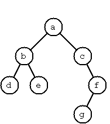
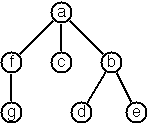
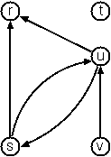
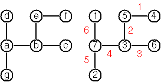
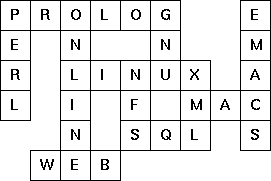

# 99 problèmes en Scala

Cette liste de tests est une version modifiée de [celle de Phil Gold][pgold].

[pgold]: http://aperiodic.net/phil/scala/s-99/

## Écrire une solution

Chaque problème a deux fichiers : l’un pour son implémentation, l’autre pour
ses tests.

L’implémentation du problème `<N>` est dans `src/main/scala/P<N>.scala` tandis
que ses tests sont dans `src/test/scala/P<N>Spec.scala`.

Écrivez votre solution dans une méthode sur l’objet `P<N>`. Vous pouvez ajoutez
ce que vous voulez en plus dans chaque fichier pour résoudre les problèmes.

Les tests sont écrits avec [ScalaTest][scalatest]. Ouvrez le fichier
`src/test/scala/P<N>Spec.scala`, et utilisez la syntaxe suivante dans la classe
`P<N>Spec`:

```scala
"le_nom_de_la_methode" should "quelque chose que la methode devrait faire" in {
  // code du test
}

it should "quelque chose d'autre" in {
  // code du test
}

// plus de tests
```

Chaque test peut utiliser `assert` pour vérifier des valeurs attendues :

```scala
assert(un_resultat == une_valeur_attendue)
```

Lisez [la documentation de ScalaTest][scalatestdocs] (en anglais) pour plus
d’informations.

[scalatest]: http://www.scalatest.org/user_guide/writing_your_first_test
[scalatestdocs]: http://www.scalatest.org/user_guide/using_assertions

Par exemple, pour un problème P00 demandant d’écrire une fonction `id` qui
retourne son seul argument, le fichier `P00.scala` ressemblera à ça :

```scala
package org.p99.scala

object P00 {

  def id[T](something : T) = something

}
```

Le fichier `P00Spec.scala` pourra ressembler à ça :

```scala
package org.p99.scala

import org.scalatest._

class P01Spec extends UnitSpec {

    "id" should "return its argument" in {
        assert(P00.id(42) == 42)
        assert(P00.id(-5) == -5)
    }

    // test inutile juste pour la démo
    it should "also return its argument" in {
        assert(P00.id(List()) == List())
    }

    it should "do something else" in {
        // ...
    }
}
```

## Testez

Lancez `sbt` dans le répertoire racine du projet :

    $ sbt

Tapez ensuite `test` pour tester. Vous pouvez aussi utiliser `sbt test`
directement depuis la ligne de commande mais ça prendra plus de temps car il
faut que la JVM soit démarrée à chaque fois.

Utilisez `test-only org.p99.scala.P00Spec` pour ne tester que le problème P00
(remplacez `P00` par `P01` pour le problème P01, etc).

## Problèmes

### P01 (facile)

Trouvez le dernier élément d’une liste.

Exemple :

    scala> last(List(1, 1, 2, 3, 5, 8))
    res0: Int = 8

### P02 (facile)

Trouvez l’avant-dernier élément d’une liste.

Exemple :

    scala> penultimate(List(1, 1, 2, 3, 5, 8))
    res0: Int = 5

### P03 (facile)

Trouvez le K<sup>ème</sup> élément d’une liste. Par convention, le premier
élément commence à 0.

Exemple :

    scala> nth(2, List(1, 1, 2, 3, 5, 8))
    res0: Int = 2

### P04 (facile)

Trouvez le nombre d’éléments d’une liste.

Exemple :

    scala> length(List(1, 1, 2, 3, 5, 8))
    res0: Int = 6

### P05 (facile)

Inversez une liste.

Exemple :

    scala> reverse(List(1, 1, 2, 3, 5, 8))
    res0: List[Int] = List(8, 5, 3, 2, 1, 1)

### P06 (facile)

Déterminez si une liste est un palindrome.

Exemple :

    scala> isPalindrome(List(1, 2, 3, 2, 1))
    res0: Boolean = true

### P07 (moyen)

Désimbriquez une liste.

Exemple :

    scala> flatten(List(List(1, 1), 2, List(3, List(5, 8))))
    res0: List[Any] = List(1, 1, 2, 3, 5, 8)

### P08 (moyen)

Supprimez les éléments consécutifs dupliqués. Si une liste contient plusieurs
éléments égaux répétés, ils doivent êtres remplacés par une seule occurrence de
l’élément. L’ordre des éléments ne doit pas être modifié.

Exemple :

    scala> compress(List('a, 'a, 'a, 'a, 'b, 'c, 'c, 'a, 'a, 'd, 'e, 'e, 'e, 'e))
    res0: List[Symbol] = List('a, 'b, 'c, 'a, 'd, 'e)

### P09 (moyen)

Regroupez les éléments consécutifs dupliqués dans des sous-liste. Si une liste
contient des éléments répétés, ils doivent être placé dans des sous-listes
séparées.

Exemple :

    scala> pack(List('a, 'a, 'a, 'a, 'b, 'c, 'c, 'a, 'a, 'd, 'e, 'e, 'e, 'e))
    res0: List[List[Symbol]] = List(List('a, 'a, 'a, 'a), List('b), List('c, 'c), List('a, 'a), List('d), List('e, 'e, 'e, 'e))

### P10 (facile)

Codage par plage d’une liste : utilisez le résultat du problème P09 pour
implémenter la méthode de compression [par plages][p10-rle]. Les éléments
consécutifs dupliqués sont encodés comme des tuples (N, E), où N est le nombre
d’occurrences de l’élément E.

[p10-rle]: https://fr.wikipedia.org/wiki/Run-length_encoding

Exemple :

    scala> encode(List('a, 'a, 'a, 'a, 'b, 'c, 'c, 'a, 'a, 'd, 'e, 'e, 'e, 'e))
    res0: List[(Int, Symbol)] = List((4,'a), (1,'b), (2,'c), (2,'a), (1,'d), (4,'e))

### P11 (facile)

Codage par plage modifié : modifiez le résultat du problème P10 tel que si un
élément n’est pas dupliqué il est simplement copié dans la liste résultante.
Seuls les éléments dupliqués sont transférés comme des tuples (N, E).

Exemple :

    scala> encodeModified(List('a, 'a, 'a, 'a, 'b, 'c, 'c, 'a, 'a, 'd, 'e, 'e, 'e, 'e))
    res0: List[Any] = List((4,'a), 'b, (2,'c), (2,'a), 'd, (4,'e))

### P12 (moyen)

Décodez une liste telle que celles retournées par la fonction du problème P11.

Exemple :

    scala> decode(List((4, 'a), (1, 'b), (2, 'c), (2, 'a), (1, 'd), (4, 'e)))
    res0: List[Symbol] = List('a, 'a, 'a, 'a, 'b, 'c, 'c, 'a, 'a, 'd, 'e, 'e, 'e, 'e)

### P13 (moyen)

Codage par plage directe : implémentez la méthode de compression décrite dans
le problème P11 directement, c’est-à-dire sans utiliser de méthode déjà écrite
(comme la méthode `pack` du problème P09) : faites tout directement.

Exemple :

    scala> encodeDirect(List('a, 'a, 'a, 'a, 'b, 'c, 'c, 'a, 'a, 'd, 'e, 'e, 'e, 'e))
    res0: List[(Int, Symbol)] = List((4,'a), (1,'b), (2,'c), (2,'a), (1,'d), (4,'e))

### P14 (facile)

Dupliquez les éléments d’une liste.

Exemple :

    scala> duplicate(List('a, 'b, 'c, 'c, 'd))
    res0: List[Symbol] = List('a, 'a, 'b, 'b, 'c, 'c, 'c, 'c, 'd, 'd)

### P15 (moyen)

Dupliquez les éléments d’une liste un nombre donné de fois.

Exemple :

    scala> duplicateN(3, List('a, 'b, 'c, 'c, 'd))
    res0: List[Symbol] = List('a, 'a, 'a, 'b, 'b, 'b, 'c, 'c, 'c, 'c, 'c, 'c, 'd, 'd, 'd)

### P16 (moyen)

Supprimez chaque N<sup>ème</sup> élément d’une liste.

Exemple :

    scala> drop(3, List('a, 'b, 'c, 'd, 'e, 'f, 'g, 'h, 'i, 'j, 'k))
    res0: List[Symbol] = List('a, 'b, 'd, 'e, 'g, 'h, 'j, 'k)

### P17 (facile)

Divisez une liste en deux parts, la longueur de la première étant donnée.
Utilisez un `Tuple` pour votre résultat.

Exemple :

    scala> split(3, List('a, 'b, 'c, 'd, 'e, 'f, 'g, 'h, 'i, 'j, 'k))
    res0: (List[Symbol], List[Symbol]) = (List('a, 'b, 'c),List('d, 'e, 'f, 'g, 'h, 'i, 'j, 'k))

### P18 (moyen)

Extrayez une partie d’une liste. Soit deux indices I et K, retournez une
sous-liste comprenant les éléments entre (et incluant) le I<sup>ème</sup> et
le K<sup>ème</sup> (exclu). Commencez à comptez à 0.

Exemple :

    scala> slice(3, 7, List('a, 'b, 'c, 'd, 'e, 'f, 'g, 'h, 'i, 'j, 'k))
    res0: List[Symbol] = List('d, 'e, 'f, 'g)

### P19 (moyen)

Faites une rotation de liste N fois à gauche.

Exemples:

    scala> rotate(3, List('a, 'b, 'c, 'd, 'e, 'f, 'g, 'h, 'i, 'j, 'k))
    res0: List[Symbol] = List('d, 'e, 'f, 'g, 'h, 'i, 'j, 'k, 'a, 'b, 'c)

    scala> rotate(-2, List('a, 'b, 'c, 'd, 'e, 'f, 'g, 'h, 'i, 'j, 'k))
    res1: List[Symbol] = List('j, 'k, 'a, 'b, 'c, 'd, 'e, 'f, 'g, 'h, 'i)

### P20 (facile)

Supprimez le K<sup>ème</sup> élément d’une liste. Retournez la nouvelle liste et
l’élément supprimé dans un `Tuple`. Les éléments sont numérotés à partir de 0.

Exemple :

    scala> removeAt(1, List('a, 'b, 'c, 'd))
    res0: (List[Symbol], Symbol) = (List('a, 'c, 'd),'b)

### P21 (facile)

Insérez un élément à une position donnée dans une liste.

Exemple :

    scala> insertAt('new, 1, List('a, 'b, 'c, 'd))
    res0: List[Symbol] = List('a, 'new, 'b, 'c, 'd)

### P22 (facile)

Créez une liste contenant tous les entiers dans un intervalle donné.

Exemple :

    scala> range(4, 9)
    res0: List[Int] = List(4, 5, 6, 7, 8, 9)

### P23 (moyen)

Extrayez un nombre donné d’élément choisis aléatoirement depuis une liste.

Exemple :

    scala> randomSelect(3, List('a, 'b, 'c, 'd, 'f, 'g, 'h))
    res0: List[Symbol] = List('e, 'd, 'a)

Astuce : utilisez la solution du problème P20.

### P24 (facile)

Loto : Générez N nombres aléatoires différents depuis l’intervalle 1..M.

Exemple :

    scala> lotto(6, 49)
    res0: List[Int] = List(23, 1, 17, 33, 21, 37)

### P25 (facile)

Générez une permutation aléatoire des éléments d’une liste.

Exemple :

    scala> randomPermute(List('a, 'b, 'c, 'd, 'e, 'f))
    res0: List[Symbol] = List('b, 'a, 'd, 'c, 'e, 'f)

Astuce : utilisez la solution du problème P23.

### P26 (moyen)

Générez les combinaisons de K éléments distincts choisis parmi les N éléments
d’une liste. En combien de façons différentes peut-on choisir un comité de 3
personnes dans un groupe de 12 ? Il y a C(12, 3) = 220 possibilités (C(N, K)
représente le coefficient binomial). Pour les mathématiciens, ce résultat peut
être très bien. Mais nous voulons vraiment générer toutes les possibilités.

Exemple :

    scala> combinations(3, List('a, 'b, 'c, 'd, 'e, 'f))
    res0: List[List[Symbol]] = List(List('a, 'b, 'c), List('a, 'b, 'd), List('a, 'b, 'e), ...

### P27 (moyen)

Groupez les éléments d’un ensemble en sous-ensembles disjoints.

En combien de façons différentes peut-on faire travailler un groupe de 9
personnes en trois groupes disjoints de 2, 3 et 4 personnes ? Écrivez une
fonction qui génère toutes les possibilités.

Exemple :

    scala> group3(List("Aldo", "Beat", "Carla", "David", "Evi", "Flip", "Gary", "Hugo", "Ida"))
    res0: List[List[List[String]]] = List(List(List(Aldo, Beat), List(Carla, David, Evi), List(Flip, Gary, Hugo, Ida)), ...

### P28 (moyen)

Généralisez le prédicat du problème P27 de façon à ce qu’on puisse spécifier
une liste de tailles de groupes.

Exemple :

    scala> group(List(2, 2, 5), List("Aldo", "Beat", "Carla", "David", "Evi", "Flip", "Gary", "Hugo", "Ida"))
    res0: List[List[List[String]]] = List(List(List(Aldo, Beat), List(Carla, David), List(Evi, Flip, Gary, Hugo, Ida)), ...

Notez qu’on ne veut pas faire de permutations sur les membres de groupes, i.e.
`((Aldo, Beat), ...)` ne représente pas la même solution que
`((Beat, Aldo), ...)`. Cependant, nous faisons une différence entre
`((Aldo, Beat), (Carla, David), ...)` et `((Carla, David), (Aldo, Beat), ...)`.

### P29 (moyen)

Triez une liste de listes en fonction de la longueur des sous-listes. On
suppose qu’une liste contient des éléments qui sont eux-mêmes des listes.
L’objectif est de trier les éléments de la liste en fonction de leur longueur,
c’est-à-dire avec les courtes listes en premier et les plus longues en dernier,
ou vice-versa.

Exemple :

    scala> lsort(List(List('a, 'b, 'c), List('d, 'e), List('f, 'g, 'h), List('d, 'e), List('i, 'j, 'k, 'l), List('m, 'n), List('o)))
    res0: List[List[Symbol]] = List(List('o), List('d, 'e), List('d, 'e), List('m, 'n), List('a, 'b, 'c), List('f, 'g, 'h), List('i, 'j, 'k, 'l))

### P30 (moyen)

Ce problème est une suite du problème P29. On suppose qu’on a le même type de
liste que défini précédemment, mais cette fois-ci l’objectif est de trier les
éléments par rapport à leur fréquence de longueur, i.e. les listes avec les
longueurs les plus rares sont en premier et celles avec les longueurs les plus
fréquentes sont en dernier.

Exemple :

    scala> lsortFreq(List(List('a, 'b, 'c), List('d, 'e), List('f, 'g, 'h), List('d, 'e), List('i, 'j, 'k, 'l), List('m, 'n), List('o)))
    res1: List[List[Symbol]] = List(List('i, 'j, 'k, 'l), List('o), List('a, 'b, 'c), List('f, 'g, 'h), List('d, 'e), List('d, 'e), List('m, 'n))

Notez que dans l’exemple ci-dessus, les deux premières listes dans le résultat
ont une longueur de 4 et 1, et chacune de ces longueurs n’apparait qu’une fois.
Les troisième et quatrième listes ont une longueur de 3 et il y a deux listes
avec cette longueur. Enfin, les trois dernières ont une longueur de 1, c’est la
longueur la plus fréquente.

### P31 (moyen)

Déterminez si un entier donné est premier.

Exemple :

    scala> isPrime(7)
    res0: Boolean = true

### P32 (moyen)

Déterminez le plus grand diviseur commun (PGCD) de deux entiers positifs
non nuls.
Utilisez l’algorithme d’Euclide.

Exemple :

    scala> gcd(36, 63)
    res0: Int = 9

### P33 (facile)

Vérifiez si deux entiers positifs non nuls sont premiers entre eux. Deux
nombres sont premiers entre eux si leur PGCD vaut 1.

Exemple :

    scala> isCoprimeTo(35, 64)
    res0: Boolean = true

### P34 (moyen)

Calculez la fonction indicatrice d’Euler phi(m). L’indicatrice d’Euler phi(m)
est définie comme le nombre d’entiers positifs r (1 ≤ r ≤ m) qui sont premiers
avec m.

Exemple :

    scala> totient(10)
    res0: Int = 4

### P35 (moyen)

Déterminez les facteurs premiers d’un entier positif non nul donné. Retournez
une liste contenant les facteurs en ordre ascendant.

Exemple :

    scala> primeFactors(315)
    res0: List[Int] = List(3, 3, 5, 7)

### P36 (moyen)

Ce problème est une variante du problème P35 où au lieu de retourner seulement
les facteurs, il faut retourner leur nombre d’occurrences en plus.

Exemple :

    scala> primeFactorMultiplicity(315)
    res0: List[(Int, Int)] = List((3,2), (5,1), (7,1))

De façon alternative, utilisez un `Map` pour le résultat :

    scala> primeFactorMultiplicity(315)
    res0: Map[Int,Int] = Map(3 -> 2, 5 -> 1, 7 -> 1)

### P37 (moyen)

Ce problème est une variante améliorée du problème P34. Lisez-le pour une
définition de l’Indicatrice d’Euler.
Si la liste des facteurs premiers d’un nombre m est connue sous la forme du
problème P36 alors la fonction `phi(m>)` peut être calculé plus efficacement de
la façon suivante :
Soit `[[p1, m1], [p2, m2], [p3, m3], ...]` la liste des facteurs premiers (et
leur nombre d’occurrences) d’un entier donné `m`. Alors `phi(m)` peut être
calculé avec la formule suivante :

    phi(m) = (p1-1)*p1(m1-1) * (p2-1)*p2(m2-1) * (p3-1)*p3(m3-1) * ...

Notez que <cite>a<sup>b</sup></cite> représente la <cite>b<sup>ème</sup></cite>
puissance de <cite>a</cite>.

### P38 (facile)

Comparez les deux méthodes de calcul de l’Indicatrice d’Euler. Utilisez les
solutions des problèmes P34 et P37 pour comparer les algorithmes. Essayez de
calculer `phi(10090)` par exemple.

### P39 (facile)

Construisez la liste de tous les nombres premiers présents dans un intervalle
donné.

Exemple :

    scala> listPrimesinRange(7 to 31)
    res0: List[Int] = List(7, 11, 13, 17, 19, 23, 29, 31)

### P40 (moyen)

La conjecture de Goldbach dit que chaque entier positif pair plus grand que 2
est la somme de deux nombres premiers. Par exemple 28 = 5 + 23. C’est l’un des
faits les plus connus des mathématiques qui n’a pas encore été prouvé dans le
cas général. Il a été confirmé sur des grands nombres (bien plus grands que ce
que le type `Int` de Scala peut représenter). Écrivez une fonction pour trouver
les deux nombres premiers qui composent un entier donné.

Exemple :

    scala> goldbach(28)
    res0: (Int, Int) = (5,23)

### P41 (moyen)

Soit un intervalle d’entiers donnés, affichez une liste de tous les entiers
pairs avec leur composition de Goldbach.

Exemple :

    scala> printGoldbachList(9 to 20)
    10 = 3 + 7
    12 = 5 + 7
    14 = 3 + 11
    16 = 3 + 13
    18 = 5 + 13
    20 = 3 + 17

Dans la plupart des cas, si un entier pair est écrit comme la somme de deux
nombres premiers, l’un d’entre eux est très petit. De façon très rare, les deux
nombres sont plus grands que, par exemple, 50. Essayez de trouver combien il y
a de tel cas dans l’intervalle 2..3000.

Exemple (avec une valeur minimale de 50 pour les nombres premiers) :

    scala> printGoldbachListLimited(1 to 2000, 50)
    992 = 73 + 919
    1382 = 61 + 1321
    1856 = 67 + 1789
    1928 = 61 + 1867

### P46 (moyen)

Définissez les fonctions `and`, `or`, `nand`, `nor`, `xor`, `impl`, and `equ`
(pour l’équivalence logique) qui retournent `true` ou `false` selon le résultat
de leur opération respective, par exemple `and(A, B)` est vrai si et seulement
si `A` et `B` sont tous les deux vrais.

Exemple :

    scala> and(true, true)
    res0: Boolean = true

    scala> xor(true. true)
    res1: Boolean = false

Une expression logique en deux variables peut maintenant être écrite comme une
fonction de deux variables, par exemple :
`(a: Boolean, b: Boolean) => and(or(a, b), nand(a, b))`.

### P47 (moyen)

Vous devez faire le problème P46 avant celui-ci.

Maintenant, écrivez une fonction `table2` qui affiche la table de vérité d’une
expression logique à deux variables donnée.

Exemple :

    scala> table2((a: Boolean, b: Boolean) => and(a, or(a, b)))
    A     B     result
    true  true  true
    true  false true
    false true  false
    false false false

### P48 (facile)

Continuez le problème P46 en redéfinissant `and`, `or`, etc comme opérateurs
(c’est-à-dire en les écrivant comme méthodes d’une nouvelle classe avec une
conversion  implicite depuis `Boolean`). `not` devra être gardé comme une
méthode d’objet.

Exemple :

    scala> table2((a: Boolean, b: Boolean) => a and (a or not(b)))
    A     B     result
    true  true  true
    true  false true
    false true  false
    false false false

### P49 (moyen)

Un code Gray n-bit est une séquence de chaînes à n bits construites à partir de
certaines règles. Par exemple :

    n = 1: C(1) = ("0", "1").
    n = 2: C(2) = ("00", "01", "11", "10").
    n = 3: C(3) = ("000", "001", "011", "010", "110", "111", "101", "100").

Trouvez les règles de construction et écrivez une fonction pour générer ces
codes.

Exemple :

    scala> gray(3)
    res0 List[String] = List(000, 001, 011, 010, 110, 111, 101, 100)

Testez si utiliser la mémoisation permet de rendre la fonction plus rapide.

### P50 (difficile)

Commencez par consulter un bon livre sur les mathématiques discrètes ou les
alhorithmes pour une description détaillée des codes d’Huffman !
On suppose qu’on a un ensemble de symboles avec leur fréquence, donnés comme
une liste de tuples `(S, F)`. Par exemple
`(("a", 45), ("b", 13), ("c", 12), ("d", 16), ("e", 9), ("f", 5))`.
Notre objectif est de construire une liste de tuples `(S, C)`, où `C` est le
code d’Huffman pour le symbole `S`.

Exemple :

    scala> huffman(List(("a", 45), ("b", 13), ("c", 12), ("d", 16), ("e", 9), ("f", 5)))
    res0: List[String, String] = List((a,0), (b,101), (c,100), (d,111), (e,1101), (f,1100))

### P51 (moyen)

Un arbre binaire est soit vide soit composé d’un élément racine et de deux
enfants, qui sont eux-mêmes des arbres binaires.

Nous utiliserons les classes suivantes pour représenter les arbres binaires
(aussi disponibles dans [tree1.scala][tree1]). Un `End` est équivalent à un
arbre vide. Une `Branch` a une valeur et deux arbres enfants. Les fonctions
`toString` sont arbitraires, mais permettent un affichage plus compact que
celui par défaut de Scala. Ajouter un `+` devant le `T` rend la classe
*covariante* : elle pourra supporter plusieurs sous-types du type avec lequel
elle est créée (Ceci est important pour qu’il soit possible d’avoir `End` en
singleton; en tant que singleton il doit avoir un type spécifique, donc nous
lui donnons le type `Nothing`, qui est un sous-type de tous les autres types).



[tree1]: http://aperiodic.net/phil/scala/s-99/tree1.scala

    sealed abstract class Tree[+T]
    case class Node[+T](value: T, left: Tree[T], right: Tree[T]) extends Tree[T] {
        override def toString = "T(" + value.toString + " " + left.toString + " " + right.toString + ")"
    }
    case object End extends Tree[Nothing] {
    override def toString = "."
    }
    object Node {
    def apply[T](value: T): Node[T] = Node(value, End, End)
    }


L’arbre donné en exemple ci-dessus est construit avec :

    Node('a',
        Node('b', Node('d'), Node('e')),
        Node('c', End, Node('f', Node('g'), End)))

Un arbre avec seulement une racine est construit avec `Node('a')` alors qu’un
arbre vide l’est avec `End`.

Écrivez le code précédent dans un fichier en vous assurant qu’il est
correctement typé.

### P52 (moyen)

Dans un arbre binaire équilibré, les propriétés suivantes sont vraies pour tous
les nœuds : le nombre de nœuds dans son sous-arbre gauche est presque égal au
nombre de nœuds dans son sous-arbre droit, ce qui signifie que leur différence
n’est pas plus grande que 1.
Définissez un objet appelé `Tree`. Écrivez une fonction `Tree.cBalanced` pour
construire un arbre binaire complètement balancé pour un nombre donné de nœuds.
La fonction doit générer toutes les solutions. Elle doit prendre en paramètres
le nombre de nœuds ainsi qu’une valeur à donner à chacun d’entre eux.

Exemple :

    scala> Tree.cBalanced(4, "x")
    res0: List(Node[String]) = List(T(x T(x . .) T(x . T(x . .))), T(x T(x . .) T(x T(x . .) .)), ...

### P53 (moyen)

Un arbre binaire est dit symétrique si vous pouvez tracer une ligne vertical au
milieu du nœud racine avec le sous-arbre gauche comme un miroir du sous-arbre
droit.. Ajoutez une méthode `isSymmetric` à la classe `Tree` du problème P51
pour vérifier si un arbre binaire donné est symétrique.

Astuce : Écrivez d’abord une méthode `isMirrorOf` pour vérifier si un arbre est
l’image miroir d’un autre. Nous sommes uniquement intéressés par la structure,
pas le contenu des nœuds.

Exemple :

    scala> Node('a', Node('b'), Node('c')).isSymmetric
    res0: Boolean = true

### P54 (moyen)

Écrivez une fonction pour ajouter un élément à un arbre de recherche binaire.

Exemple :

    scala> End.addValue(2)
    res0: Node[Int] = T(2 . .)

    scala> res0.addValue(3)
    res1: Node[Int] = T(2 . T(3 . .))

    scala> res1.addValue(0)
    res2: Node[Int] = T(2 T(0 . .) T(3 . .))

Astuce : la définition abstraite de `addValue` dans `Tree` devrait être
`def addValue[U >: T <% Ordered[U]](x: U): Tree[U]`. La syntaxe `>: T` est
utilisée ici car les paramètres de `addValue` doivent être des contravariants
de `T` (nous ajoutons des nœuds au dessus d’autres nœuds. Pour que les
sous-nœuds soient de type `T` ou n’importe quel sous-type, les nœuds du dessus
doivent être de type `T` ou d’un sur-type). La syntaxe
`<% Ordered[U]` nous permet d’utiliser l’opérateur `<` sur les values dans
l’arbre.

Utilisez cette fonction pour construire un arbre binaire depuis une liste
d’entiers.

    scala> Tree.fromList(List(3, 2, 5, 7, 1))
    res3: Node[Int] = T(3 T(2 T(1 . .) .) T(5 . T(7 . .)))

Enfin, utilisez cette fonction pour tester votre solution au problème P53.

    scala> Tree.fromList(List(5, 3, 18, 1, 4, 12, 21)).isSymmetric
    res4: Boolean = true

    scala> Tree.fromList(List(3, 2, 5, 7, 4)).isSymmetric
    res5: Boolean = false

### P55 (moyen)

Appliquez le paradigme « generate-and-test » (« générez-et-testez ») pour
construire tous les arbres binaires parfaitement balancés et symétriques qui
ont un nombre de nœuds donné.

Exemple :

    scala> Tree.symmetricBalancedTrees(5, "x")
    res0: List[Node[String]] = List(T(x T(x . T(x . .)) T(x T(x . .) .)), T(x T(x T(x . .) .) T(x . T(x . .))))

### 56 (moyen)

Dans un arbre binaire équilibré, la propriété suivante est vraie pour tous les
nœuds : le nombre de nœuds dans son sous-arbre gauche est presque égal au
nombre de nœuds dans son sous-arbre droit, ce qui signifie que leur différence
n’est pas plus grande que 1.
Écrivez une méthode `Tree.hbalTrees` pour construire les arbres binaires
équilibrés qui ont une hauteur donnée. La méthode prend en arguments la taille
et une valeur à donner à chaque nœud. Elle doit générer toutes les solutions.

Exemple :

    scala> Tree.hbalTrees(3, "x")
    res0: List[Node[String]] = List(T(x T(x T(x . .) T(x . .)) T(x T(x . .) T(x . .))), T(x T(x T(x . .) T(x . .)) T(x T(x . .) .)), ...

### P57 (moyen)

Considérons un arbre binaire équilibré de hauteur H. Quel le nombre maximal de
nœuds qu’il peut contenir ? Clairement, MaxN = 2<sup>H</sup> - 1. Cependant,
quel est le nombre MinN minimum ? La question est plus difficile. Essayez de
trouver une implémentation récursive et utilisez-la pour écrire une fonction
`minHbalNodes` qui prend une taille et retourne `MinN`.

Exemple :

    scala> minHbalNodes(3)
    res0: Int = 4

### P58 (moyen)

Ce problème est la suite du problème P57.

D’un autre côté, nous pouvons nous demander quelle est la taille maximale H
d’un arbre binaire équilibré avec N nœuds. Écrivez une fonction `maxHbalHeight`
pour y répondre.

Exemple :

    scala> maxHbalHeight(4)
    res1: Int = 3

### P59 (moyen)

Ce problème est la suite du problème P58.

Nous pouvons maintenant attaquer le problème principal : construisez tous les
arbres binaires équilibrés avec un nombre donné de nœuds.

Exemple :

    scala> Tree.hbalTreesWithNodes(4, "x")
    res2: List[Node[String]] = List(T(x T(x T(x . .) .) T(x . .)), T(x T(x . T(x . .)) T(x . .)), ...

Trouvez combien d’arbres équilibrés existent pour N = 15.

### P60 (facile)

Une feuille est un nœud sans enfants. Écrivez une méthode `leafCount` pour les
compter.

Exemple :

    scala> Node('x', Node('x'), End).leafCount
    res0: Int = 1

### 61 (facile)

Une feuille est un nœud sans enfants. Écrivez une méthode `leafList` pour les
récupérer dans une liste.

Exemple :

    scala> Node('a', Node('b'), Node('c', Node('d'), Node('e'))).leafList
    res0: List[Char] = List(b, d, e)

### P62 (facile)

Un nœud interne d’arbre binaire a soit un ou deux enfants non-vides. Écrivez
une méthode `internalList` pour les récupérer sous forme de liste.

Exemple :

    scala> Node('a', Node('b'), Node('c', Node('d'), Node('e'))).internalList
    res0: List[Char] = List(a, c)

### P63 (facile)

Un nœud d’arbre binaire est au niveau N si le chemin depuis la racine jusqu’au
nœud a une longueur N-1. La racine est au niveau 1. Écrivez une méthode
`atLevel` pour récupérer tous les nœuds à un niveau donné sous forme de liste.

Exemple :

    scala> Node('a', Node('b'), Node('c', Node('d'), Node('e'))).atLevel(2)
    res0: List[Char] = List(b, c)

Il est facile de construire une méthode `levelOrder` en utilisant `atLevel` qui
crée une séquence de tous les nœuds ordonnés par leur niveau. Il y a aussi des
façons plus efficaces de le faire.

### P64 (moyen)

Un arbre binaire complet de taille H est défini de la façon suivante : les
niveaux 1, 2, 3, …, H-1 contiennent le nombre maximal de nœuds (soit
2<sup>(i-1)</sup> au niveau i, sachant que la racine est au niveau 1). Tous les
nœuds d’un niveau H, qui peut contenir moins que le nombre maximum de nœuds,
sont « alignés à gauche. » Cela signifie que si l’on parcours les nœuds suivant
l’ordre retourné par `levelOrder` (voir problème P63), tous les nœuds internes
viennent en premier, puis les feuilles, puis les enfants vides (les `End`s qui
ne sont pas vraiment des nœuds !). En particulier, les arbres binaires complets
sont utilisés comme structures de données pour les tas.

Nous pouvons assigner un numéro d’adresse à chaque nœud d’un arbre binaire
complet en énumérant les nœuds avec `levelOrder`, en commençant avec 1 pour la
racine. En faisant ça, nous réalisons que pour chaque nœud X avec une adresse A
la propriété suivante s’applique : l’adresse des enfants gauche et droite de X
sont respectivement 2\*A et 2\*A+1, en supposant que ces enfants existent. Ce
fait peut être utilisé pour construire élégamment une structure d’arbre binaire
complet. Écrivez une méthode `completeBinaryTree` qui prend en paramètres le
nombre de nœuds et la valeur à donner à chacun d’eux.

Exemple :

    scala> Tree.completeBinaryTree(6, "x")
    res0: Node[String] = T(x T(x T(x . .) T(x . .)) T(x T(x . .) .))

### P65 (moyen)

Afin de dessiner un arbre, un algorithme de placement est requis pour
pouvoir déterminer la position de chaque nœud sur une grille rectangulaire. De
nombreuses méthodes sont envisageables, l’une d’entre elles est visible sur
l’image ci-dessous. Dans cette stratégie de placement, la position d’un nœud v
est obtenue par les deux règles suivantes :

* x(v) est égal à la position du nœud v dans la séquence <i>inorder</i>
* y(v) est égal à la profondeur du nœud v dans l’arbre


Nous ajoutons une nouvelle classe avec plus d’informations pour stocker la
position des nœuds.

    case class PositionedNode[+T](override val value: T,
        override val left: Tree[T], override val right: Tree[T],
        x: Int, y: Int) extends Node[T](value, left, right) {
      override def toString =
        "T[" + x.toString + "," + y.toString + "]" +
            "(" + value.toString + " " + left.toString + " " + right.toString + ")"
    }

Écrivez une méthode `layoutBinaryTree` qui transforme un arbre composé
de`Node`s normaux en un arbre de `PositionedNode`s.

    scala> Node('a', Node('b', End, Node('c')), Node('d')).layoutBinaryTree
    res0: PositionedNode[Char] = T[3,1](a T[1,2](b . T[2,3](c . .)) T[4,2](d . .))

L’arbre de l’image peut être construit avec :

    Tree.fromList(List('n','k','m','c','a','h','g','e','u','p','s','q'))

Utilisez-le pour tester votre code.

### P66 (moyen)

Un placement alternatif est montré dans l’illustration ci-dessous.
Trouvez les règles et écrivez la méthode correspondante. Astuce : à un niveau
donné, la distance horizontale entre les nœuds voisins est constante.


Utilisez les mêmes conventions que dans le problème P65.

Exemple :

    scala> Node('a', Node('b', End, Node('c')), Node('d')).layoutBinaryTree2
    res0: PositionedNode[Char] = T[3,1]('a T[1,2]('b . T[2,3]('c . .)) T[5,2]('d . .))

L’arbre de l’image peut être construit avec :

    Tree.fromList(List('n','k','m','c','a','e','d','g','u','p','q'))

Utilisez-le pour vérifier votre code.

### P67 (difficile)

Une autre stratégie de placement est montrée dans l’image ci-dessous. La
méthode construit un placement très compacte tout en maintenant une certaine
symétrie pour chaque nœud. Trouvez les règles et écrivez la méthode
correspondante. Astuce : Regardez la distance horizontale entre un nœuds et ses
nœuds enfants. Comment pouvez-vous combiner deux sous-arbres ensembles pour
former l’arbre binaire résultant ?

Utilisez les mêmes conventions que pour les problèmes P65 et P66. Note : c’est
un problème difficile, n’abandonnez pas trop tôt !

Exemple :

    scala> Node('a', Node('b', End, Node('c')), Node('d')).layoutBinaryTree3
    res0: PositionedNode[Char] = T[2,1]('a T[1,2]('b . T[2,3]('c . .)) T[3,2]('d . .))


Which layout do you like most?

### P68 (moyen)

On peut représenter les arbres binaires par des chaînes de caractères du type
suivant (voir example ci-dessous) :

    a(b(d,e),c(,f(g,)))


Écrivez une méthode qui génère cette représentation textuelle, si l’arbre est
donné comme d’habitude (en `Node`s et `End`s). Utilisez cette méthode pour la
méthode `toString` de la classe `Tree` et de ses sous-classes. Écrivez ensuite
une méthode (sur l’objet `Tree`) qui fait l’inverse : elle construit un arbre à
partir de sa représentation textuelle.

Pour faire simple, supposez que chaque nœud ne contient qu’une seule lettre et
qu’il n’y a pas d’espaces dans la chaîne.

Exemple :

    scala> Node('a', Node('b', Node('d'), Node('e')), Node('c', End, Node('f', Node('g'), End))).toString
    res0: String = a(b(d,e),c(,f(g,)))

    scala> Tree.fromString("a(b(d,e),c(,f(g,)))")
    res1: Node[Char] = a(b(d,e),c(,f(g,)))

### P69 (moyen)

On utilise ici des arbres binaires avec nœuds identifiés par une seule lettre
minuscule, comme dans l’exemple du problème P68.

Écrivez les méthodes `preorder` et `inorder` qui construisent respectivement
les séquences préfixe et postfixe. Les résultats sont des listes, comme
`List('a','b','d','e','c','f','g')` pour la séquence préfixe de l’exemple du
problème P68.

Exemple :

    scala> Tree.string2Tree("a(b(d,e),c(,f(g,)))").preorder
    res0: List[Char] = List(a, b, d, e, c, f, g)

    scala> Tree.string2Tree("a(b(d,e),c(,f(g,)))").inorder
    res1: List[Char] = List(d, b, e, a, c, g, f)

### P70 (moyen)

Ce problème est la suite du problème P69.

Si les séquences préfixe et postfixe de nœuds d’un arbre binaire sont toutes
les deux données, alors l’arbre peut être déterminé sans ambiguité. Écrivez une
méthode `preInTree` qui fait le travail pour vous.

Exemple :

    scala> Tree.preInTree(List('a', 'b', 'd', 'e', 'c', 'f', 'g'), List('d', 'b', 'e', 'a', 'c', 'g', 'f'))
    res2: Node[Char] = a(b(d,e),c(,f(g,)))

Que se passe-t-il si la même lettre apparaît dans plus d’un seul nœud ?
Essayez, par exemple,
`Tree.preInTree(List('a', 'b', 'a'), List('b', 'a', 'a'))`.

### P71 (moyen)

On utilise encore ici les arbres binaires dont les nœuds sont identifiés par
une lettre minuscule, comme dans l’exemple du problème P68. Un tel arbre peut
être représenté par la séquence préfixe de ses nœuds dans laquelle les points
(`.`) sont insérés quand on rencontre un sous-arbre vide (`End`) durant le
parcours. Par exemple, l’arbre du problème P68 est représenté par
`"abd..e..c.fg..."`. Essayez d’abord d’établir une syntaxe (BNF ou diagrammes
de syntaxe) puis écrivez deux méthodes, `toDotstring` et `fromDotstring` qui
font les conversions dans chaque sens.

Exemple :

    scala> Tree.string2Tree("a(b(d,e),c(,f(g,)))").toDotstring
    res0: String = abd..e..c.fg...

    scala> Tree.fromDotstring("abd..e..c.fg...")
    res1: Node[Char] = a(b(d,e),c(,f(g,)))

### P72 (facile)

Un arbre (non-binaire) est composé d’un élément racine et d’un ensemble
(possiblement vide) d’enfants qui sont eux-même des arbres. Un arbre n’est
jamais vide. L’ensemble des enfants est parfois appelé une forêt.

Le code utilisé pour représenter ces arbres est plus simple que celui des
arbres binaires, en partie parce que nous n’avons pas de classes séparées pour
les nœuds et les terminaisons, et en partie parce que nous n’avons pas besoin
de restreindre le type de valeur, qui n’est pas nécessairement ordonnable ici.

    case class MTree[+T](value: T, children: List[MTree[T]]) {
        def this(value: T) = this(value, List())
        override def toString = "M(" + value.toString + " {" + children.map(_.toString).mkString(",") + "})"
    }

    object MTree {
        def apply[T](value: T) = new MTree(value, List())
        def apply[T](value: T, children: List[MTree[T]]) = new MTree(value, children)
    }

L’arbre d’exemple est donc :

    MTree('a', List(MTree('f', List(MTree('g'))), MTree('c'), MTree('b', List(MTree('d'), MTree('e')))))

Écrivez ce code initial dans un fichier et assurez-vous qu’il est bien typé.

### P73 (facile)

Écrivez une méthode `nodeCount` qui compte les nœuds d’un arbre donné.

Exemple :

    scala> MTree('a', List(MTree('f'))).nodeCount
    res0: Int = 2

### P74 (moyen)

On suppose que chacun des nœuds d’un arbre ne contient qu’une lettre. On peut
représenter un arbre par la séquence des nœuds traversés lors d’un parcours en
profondeur, en utilisant un caractère spécial (`^`) pour indiquer quand on
remonte dans l’arborescence.
Avec cette règle, l’arbre de l’image ci-dessous est représenté par :

    afg^^c^bd^e^^^



Définissez la syntaxe de la chaîne de caractères et écrivez une fonction
`string2MTree` pour construire un `MTree` depuis une `String`. Écrivez-la de
façon à ce qu’elle soit une conversion implicite depuis `String`. Écrivez la
fonction inverse dans une méthode `toString` de la classe `MTree`.

Exemple :

    scala> MTree('a', List(MTree('f', List(MTree('g'))), MTree('c'), MTree('b', List(MTree('d'), MTree('e'))))).toString
    res0: String = afg^^c^bd^e^^^

### P75 (facile)

On défini la longueur du chemin interne d’un arbre comme la somme totale des
longueurs des chemins depuis la racine jusqu’à tous les nœuds de l’arbre. Avec
cette définition, l’arbre de la figure du problème P74 a une longueur de chemin
interne de 9. Écrivez une méthode `internalPathLength` pour retourner cette
somme.

Exemple :

    scala> "afg^^c^bd^e^^^".internalPathLength
    res0: Int = 9

### P76 (facile)

Écrivez une méthode `postorder` qui construit la séquence préfixe des nœuds
d’un arbre. Le résultat doit être une liste.

Exemple :

    scala> "afg^^c^bd^e^^^".postorder
    res0: List[Char] = List(g, f, c, d, e, b, a)

### P77 (moyen)

Lisp propose une notation particulière pour les arbres. C’est un langage de
programmation fonctionnelle majeur. En Lisp, presque tout est une list. Notre
arbre d’exemple serait représenté comme `(a (f g) c (b d e))`. Les images
ci-dessous montrent plus d’exemples.


Notez que dans la notation « lispée » un nœud et ses enfants dans l’arbre est
toujours le premier élément d’une liste, suivi par ses enfants. La
représentation « lispée » d’un arbre est une séquence d’atomes et parenthèses
'(' et ')', avec les atomes séparés par des espaces. Nous pouvons représenter
cette syntaxe avec la `String` de Scala. Écrivez une méthode `lispyTree` qui
construit une `String` « lispée » à partir d’un `MTree`.

Exemple :

    scala> MTree("a", List(MTree("b", List(MTree("c"))))).lispyTree
    res0: String = (a (b c))

Un second exercice, plus intéressant, consiste à écrire une méthode qui prend
une chaîne « lispée » et retourne l’arbre correspondant.

### P78 (moyen)

Un graphe est défini comme un ensemble de nœuds et un ensemble d’arrêtes (ou
liens), où chaque arrête est une paire de nœuds.

La classe qui représente un graph est mutable, ce qui n’est pas de la bonne
programmation fonctionnelle, mais une structure de données purement
fonctionnelle rendrait les choses vraiment, vraiment plus compliquées.

Nos `Graph`s utilisent une liste d’adjacences en interne. Chacun d’entre eux a
une liste de nœuds et une liste d’arrêtes. Chaque nœud a aussi une liste
d’arrête qui le connecte à d’autres nœuds. Dans un graphe dirigé, les nœuds
qui sont les cibles d’arrêtes n’ont pas de références à ces arrêtes dans leur
liste d’adjacence.


    abstract class GraphBase[T, U] {
      case class Edge(n1: Node, n2: Node, value: U) {
          def toTuple = (n1.value, n2.value, value)
      }
      case class Node(value: T) {
          var adj: List[Edge] = Nil
          def neighbors: List[Node] = adj.map(edgeTarget(_, this).get)
      }

      var nodes: Map[T, Node] = Map()
      var edges: List[Edge] = Nil

      // Si l’arrête E connecte N à un autre nœud, retourne l’autre nœud,
      // retourne None sinon.
      def edgeTarget(e: Edge, n: Node): Option[Node]

      override def equals(o: Any) = o match {
          case g: GraphBase[T,U] => (nodes.keys.toList -- g.nodes.keys.toList == Nil &&
                                  edges.map(_.toTuple) -- g.edges.map(_.toTuple) == Nil)
          case _ => false
      }

      def addNode(value: T) = {
          val n = new Node(value)
          nodes = Map(value -> n) ++ nodes
          n
      }
    }

    class Graph[T, U] extends GraphBase[T, U] {
      override def equals(o: Any) = o match {
          case g: Graph[T,U] => super.equals(g)
          case _ => false
      }

      def edgeTarget(e: Edge, n: Node): Option[Node] =
          if (e.n1 == n) Some(e.n2)
          else if (e.n2 == n) Some(e.n1)
          else None

      def addEdge(n1: T, n2: T, value: U) = {
          val e = new Edge(nodes(n1), nodes(n2), value)
          edges = e :: edges
          nodes(n1).adj = e :: nodes(n1).adj
          nodes(n2).adj = e :: nodes(n2).adj
      }
    }

    class Digraph[T, U] extends GraphBase[T, U] {
      override def equals(o: Any) = o match {
          case g: Digraph[T,U] => super.equals(g)
          case _ => false
      }

      def edgeTarget(e: Edge, n: Node): Option[Node] =
          if (e.n1 == n) Some(e.n2)
          else None

      def addArc(source: T, dest: T, value: U) = {
          val e = new Edge(nodes(source), nodes(dest), value)
          edges = e :: edges
          nodes(source).adj = e :: nodes(source).adj
      }
    }

Le code initial complet, qui inclus des objets pour créer des graphes, est dans
[graph1.scala][graph1].

[graph1]: http://aperiodic.net/phil/scala/s-99/graph1.scala

Il y a plusieurs façons de créer un graphe à partir de primitives. La forme
<em>graph-term</em> liste les nœuds et les arrêtes séparément :

    Graph.term(List('b', 'c', 'd', 'f', 'g', 'h', 'k'),
            List(('b', 'c'), ('b', 'f'), ('c', 'f'), ('f', 'k'), ('g', 'h')))

La forme <em>adjacency-list</em> associe chaque nœud avec ses nœuds adjacents.
Dans un graphe non dirigé, il faut faire attention à ce que chaque arrête soit
symétrique : si b est adjacent à c, c doit aussi être adjacent à b.

    Graph.adjacent(List(('b', List('c', 'f')), ('c', List('b', 'f')), ('d', Nil),
                        ('f', List('b', 'c', 'k')), ('g', List('h')), ('h', List('g')),
                        ('k', List('f'))))

Les représentations introduites jusqu’ici dépendent de notre implémentation et
ne sont donc pas adaptées pour du traitement automatisé, mais leur syntaxe
n’est pas très lisible. Écrire les termes à la main est compliqué et il est
facile de faire des erreurs. Nous pouvous définir une notation plus lisible et
compacte de la façon suivante : un graphe est représenté comme une chaîne de
termes du type X ou Y-Z séparés par des virgules. Les termes seuls représentent
les nœuds isolés, et les termes Y-Z représentent les arrêtes. Si un X apparaît
comme extrémité d’une arrête, il est automatiquement défini comme nœud. Notre
exemple pourrait être écrit de la façon suivante :

    [b-c, f-c, g-h, d, f-b, k-f, h-g]

Nous appelons cette représentation la forme <em>human-friendly</em>. Comme le
montre l’exemple, la liste n’a pas besoin d’être triée et peut même contenir la
même arrête plusieurs fois. Notez le d isolé.



Quand les arrêtes d’un graphe sont dirigées, nous les appelons « arcs. » Ils
sont représentés par des paires ordonnées. Un tel graphe est appelé « graphe
dirigé » (digraphe). Pour le représenter, les formes présentées précédemment
sont légèrement modifiées.
Le graphe d’exemple ci-dessus est représenté des façons suivantes :

forme graph-term:

    Digraph.term(List('r', 's', 't', 'u', 'v'),
                List(('s', 'r'), ('s', 'u'), ('u', 'r'), ('u', 's'), ('v', 'u')))

forme adjacency-list:

    Digraph.adjacent(List(('r', Nil), ('s', List('r', 'u')), ('t', Nil),
                        ('u', List('r', 's')), ('v', List('u'))))

(Notez que la forme adjancy-list est la même pour les graphes et digraphes.)

forme human-friendly:

    [s>r, t, u>r, s>u, u>s, v>u]

Enfin, les graphes et les digraphes peuvent avoir plus d’informations associées
aux nœuds et arrêtes (arcs). Pour les nœuds, il n’y a pas de problème puisque
nous utilisons n’importe quel type pour les représentés. Nous devons étendre
notre notation pour les arrêtes. Les graphes avec des informations
additionnelles associées aux arrêtes sont appelés « graphes libellés. »

forme graph-term:

    Digraph.termLabel(List('k', 'm', 'p', 'q'),
                    List(('m', 'q', 7), ('p', 'm', 5), ('p', 'q', 9)))

forme adjacency-list:

    Digraph.adjacentLabel(
    List(('k', Nil), ('m', List(('q', 7))), ('p', List(('m', 5), ('q', 9))),
        ('q', Nil)))

forme human-friendly:

    [p>q/9, m>q/7, k, p>m/5]

La notation pour les graphes libellés peut aussi être utilisée pour les
« multi-graphes, » où plus d’une seule arrête (ou arc) est autorisée entre deux
nœuds donnés.

### P79 (difficile)

Écrivez des méthodes pour générer les formes graph-term et adjancy-list depuis
un `Graph`. Écrivez une autre méthode pour afficher la forme human-friendly
d’un graphe. Utilisez-là pour la méthode `toString` de `Graph`. Écrivez
d’autres fonctions pour créer des graphes à partir de chaînes de caractères.

Astuce : Vous aurez peut-être besoin d’utiliser des fonctions séparées pour les
graphes libellés et non-labellés.

Exemple :

    scala> Graph.fromString("[b-c, f-c, g-h, d, f-b, k-f, h-g]").toTermForm
    res0: (List[String], List[(String, String, Unit)]) = (List(d, k, h, c, f, g, b),List((h,g,()), (k,f,()), (f,b,()), (g,h,()), (f,c,()), (b,c,())))

    scala> Digraph.fromStringLabel("[p>q/9, m>q/7, k, p>m/5]").toAdjacentForm
    res1: List[(String, List[(String, Int)])] = List((m,List((q,7))), (p,List((m,5), (q,9))), (k,List()), (q,List()))

### P80 (moyen)

Écrivez une méthode `findPaths` pour trouver les chemins acycliques depuis un
nœud vers un autre dans un graphe. La méthode doit retourner tous les chemins.

Exemple :

    scala> Digraph.fromStringLabel("[p>q/9, m>q/7, k, p>m/5]").findPaths("p", "q")
    res0: List[List[String]] = List(List(p, q), List(p, m, q))

    scala> Digraph.fromStringLabel("[p>q/9, m>q/7, k, p>m/5]").findPaths("p", "k")
    res1: List[List[String]] = List()

### P81 (facile)

Écrivez une méthode `findCycles` pour trouver les chemins fermés (cycles) qui
commencent à un nœud donné dans un graphe. La méthode doit retourner tous les
cycles.

Exemple :

    scala> Graph.fromString("[b-c, f-c, g-h, d, f-b, k-f, h-g]").findCycles("f")
    res0: List[List[String]] = List(List(f, c, b, f), List(f, b, c, f))

### P82 (moyen)

Écrivez une méthode `spanningTrees` pour construire tous les arbres couvrant
d’un graphe donné. Avec cette méthode, trouvez combien d’arbres couvrant sont
possibles pour le graphe ci-dessous. Les données pour le graphe d’exemple sont
données ci-dessous. Quand vous aurez la bonne solution pour la méthode
`spanningTrees`, utilisez-la pour définir deux autres méthodes utiles :
`isTree` (teste si un graphe est un arbre) et `isConnected`. Toutes les deux
peuvent être écrites en 5 minutes !


Graphe:

    Graph.term(List('a', 'b', 'c', 'd', 'e', 'f', 'g', 'h'),
            List(('a', 'b'), ('a', 'd'), ('b', 'c'), ('b', 'e'),
                    ('c', 'e'), ('d', 'e'), ('d', 'f'), ('d', 'g'),
                    ('e', 'h'), ('f', 'g'), ('g', 'h')))

Exemple :

    scala> Graph.fromString("[a-b, b-c, a-c]").spanningTrees
    res0: List[Graph[String,Unit]] = List([a-b, b-c], [a-c, b-c], [a-b, a-c])

### P83 (moyen)

Écrivez une méthode `minimalSpanningTree` pour construire l’arbre couvrant
minimal d’un graphe libellé donné. Astuce : utilisez l’algorithme de Prim. Une
petite modification de la solution du problème P82 permet d’écrire celle-ci.
Les données du graphe d’exemple sont données ci-dessous :


Graphe:

    Graph.termLabel(
        List('a', 'b', 'c', 'd', 'e', 'f', 'g', 'h'),
            List(('a', 'b', 5), ('a', 'd', 3), ('b', 'c', 2), ('b', 'e', 4),
                    ('c', 'e', 6), ('d', 'e', 7), ('d', 'f', 4), ('d', 'g', 3),
                    ('e', 'h', 5), ('f', 'g', 4), ('g', 'h', 1)))

Exemple :

    scala> Graph.fromStringLabel("[a-b/1, b-c/2, a-c/3]").minimalSpanningTree
    res0: Graph[String,Int] = [a-b/1, b-c/2]

### P84 (moyen)

Deux graphes G<sub>1</sub>(N<sub>1</sub>,E<sub>1</sub>) et
G<sub>2</sub>(N<sub>2</sub>,E<sub>2</sub>) sont isomorphes si il y a une
bijection f: N<sub>1</sub> → N<sub>2</sub> telle que pour n’importe quels
nœuds X, Y de N<sub>1</sub>, X et Y sont adjacents si et seulement si f(X) et f(Y) sont adjacents.

Écrivez une méthode qui détermine si deux graphes sont isomorphies.

Exemple :

    scala> Graph.fromString("[a-b]").isIsomorphicTo(Graph.fromString("[5-7]"))
    res0: Boolean = true

### P85 (moyen)

1. Écrivez une méthode `Node.degree` qui détermine le degré d’un nœud donné.
2. Écrivez une méthode qui liste tous les nœuds d’un graphe triés selon leur
   degré, du plus haut au plus bas.

Exemple :

    scala> Graph.fromString("[a-b, b-c, a-c, a-d]").nodes("a").degree
    res0: Int = 3

    scala> Graph.fromString("[a-b, b-c, a-c, a-d]").nodesByDegree
    res1: List[Graph[String,Unit]#Node] = List(Node(a), Node(c), Node(b), Node(d))

### P86 (moyen)

Utilisez l’algorithme de Welsh-Powell pour peindre les nœuds d’un graphe tels
que tous les nœuds adjacents ont des couleurs différentes. Ajoutez une méthode
`colorNodes` qui retourne une liste de tuples, chacun contenant un nœud et un
entier représentant sa couleur.

Exemple :

    scala> Graph.fromString("[a-b, b-c, a-c, a-d]").colorNodes
    res2: List[(Graph[String,Unit]#Node,Int)] = List((Node(a),1), (Node(b),2), (Node(c), 3), (Node(d), 2))

### P87 (moyen)

Écrivez une méthode qui génère une séquence de parcours en profondeur d’un
graphe. Le point de départ doit être donné, et la valeur de retour doit être
une liste de nœuds accessibles depuis ce point de départ (dans l’ordre du
parcours en profondeur).

Exemple :

    scala> Graph.fromString("[a-b, b-c, e, a-c, a-d]").nodesByDepthFrom("d")
    res0: List[String] = List(c, b, a, d)

### P88 (moyen)

Écrivez une fonction qui sépare les composants connectés d’un graph.

Exemple :

    scala> Graph.fromString("[a-b, c]").splitGraph
    res0: List[Graph[String,Unit]] = List([a-b], [c])

### P89 (moyen)

Écrivez une fonction qui détermine si un graph donné est biparti.

Exemple :

    scala> Digraph.fromString("[a>b, c>a, d>b]").isBipartite
    res0: Boolean = true

    scala> Graph.fromString("[a-b, b-c, c-a]").isBipartite
    res1: Boolean = false

    scala> Graph.fromString("[a-b, b-c, d]").isBipartite
    res2: Boolean = true

    scala> Graph.fromString("[a-b, b-c, d, e-f, f-g, g-e, h]").isBipartite
    res3: Boolean = false

### P90 (moyen)

Le problème des « huits reines » est un problème classique en informatique.
L’objectif est de placer huit reines sur un échiquier telles que deux reines ne
s’attaquent pas entre elles, c’est-à-dire que deux reines ne sont jamais sur la
même ligne, colonne ou diagonale.

Astuce : Représentez les positions des reines comme une liste de nombres
`1..N`. Par exemple `List(4, 2, 7, 3, 6, 8, 5, 1)` signifie que la reine dans
la première colonne est sur la ligne 4, la reine dans la seconde colonne est
sur la ligne 2, etc. Utilisez le paradigme « [générez-et-testez][gentest]. »

[gentest]: https://www.siggraph.org/education/materials/HyperVis/concepts/gen_test.htm

### P91 (moyen)

Un autre problème célèbre est le suivant : comment un cavalier peut-il sauter
sur un échiquier `N×N` de façon à visiter chaque case exactement une seule fois.

Astuces : représentez les cases par des paires de leurs coordonnées de la forme
`(X, Y)` où `X` et `Y` sont des entiers entre `1` et `N` (ou définissez une
classe `Point`). Écrivez une fonction `jumps(N, (X, Y))` pour lister les cases
où un cavalier peut sauter depuis `(X, Y)` sur un échiquier `N×N`. Enfin,
représentez la solution à notre problème comme une liste de positions du
cavalier (le parcours du cavalier).

Il peut être intéressant de trouver plus d’un parcours, mais un ordinateur va
mettre beaucoup de temps pour tous les trouver d’un coup. Pouvez-vous faire une
liste paresseuse qui ne va calculer les parcours qu’au moment nécessaire ?

Pouvez-vous aussi trouver uniquement les « parcours fermés, » où le cavalier
peut sauter de sa dernière position à sa première ?

### P92 (difficile)

Le puzzle de la conjecture de Von Koch est le suivant : Soit un arbre avec `N`
nœuds (et donc `N-1` arrêtes), trouvez un moyen d’énumérer les nœuds de `1` à
`N`, et, de la même façon, les arrêtes de `1` à `N-1`, de telle façon que pour
chaque arrête `K`, la différence entre les nombres de ses nœuds est égale à
`K`. La conjecture dit que c’est toujours possible.



Pour les petits arbres le problème est facile à résoudre à la main. Cependant,
pour les grands arbres, et 14 est déjà très grand, il est extrêmement difficile
de trouver la solution. Et rappelez-vous, nous ne sommes même pas sûrs qu’il y
a toujours une solution.

Écrivez une fonction qui calcule un système de numérotation pour un arbre
donné. Quelle est la solution pour l’arbre représenté ci-dessous ?


### P93 (difficile)

Soit une liste de nombres entiers donnée, trouvez une façon correcte d’insérer
des symboles arithmétiques (opérateurs) tels que le résultat soit une équation
correcte. Par exemple, avec la liste de nombres `List(2,3,5,7,11)`, nous
pouvons former les équations `2-3+5+7 = 11` ou `2 = (3*5+7)/11` (et dix autres
!).

### P94 (difficile)

Dans un graphe K-régulier, tous les nœuds ont un degré K, c’est-à-dire que le
nombre d’arrêtes partant d’un nœud sont au nombre de K. Combien y a-t-il de
graphes (non isomorphes !) 3-réguliers avec 6 nœuds ? Voir aussi une
[table de résultats][p94-table] et un [applet Java][p94-java] qui peuvent
représenter des graphes géométriquement.

[p94-table]: http://aperiodic.net/phil/scala/s-99/p94.txt
[p94-java]: https://prof.ti.bfh.ch/hew1/informatik3/prolog/p-99/GraphLayout/index.html

### P95 (moyen)

Les documents financiers tels que les chèques requièrent parfois que les
nombres soient écrits en français. Par exemple, 175 doit être écrit « cent
soixante-quinze. » Écrivez une fonction `fullWords(num: Int)` pour afficher les
entiers (positifs) en français.

### P96 (moyen)

Dans un certain langage de programmation (Ada), les identifiants sont définis
par le diagramme de syntaxe ci-dessous. Transformez le diagramme en un système
de diagrammes de syntaxe qui ne contiennent pas de boucle, donc qui sont
purement récursifs. Utilisez ces diagrammes modifiés pour écrire une fonction
`isIdentifier` qui peut vérifier si une chaîne de caractères donnée est un
identifiant valide ou non.


### P97 (moyen)

Les puzzles de Sudoku ressemblent à la figure suivante :

   Problème                          Solution

    .  .  4 | 8  .  . | .  1  7      9  3  4 | 8  2  5 | 6  1  7
            |         |                      |         |
    6  7  . | 9  .  . | .  .  .      6  7  2 | 9  1  4 | 8  5  3
            |         |                      |         |
    5  .  8 | .  3  . | .  .  4      5  1  8 | 6  3  7 | 9  2  4
    --------+---------+--------      --------+---------+--------
    3  .  . | 7  4  . | 1  .  .      3  2  5 | 7  4  8 | 1  6  9
            |         |                      |         |
    .  6  9 | .  .  . | 7  8  .      4  6  9 | 1  5  3 | 7  8  2
            |         |                      |         |
    .  .  1 | .  6  9 | .  .  5      7  8  1 | 2  6  9 | 4  3  5
    --------+---------+--------      --------+---------+--------
    1  .  . | .  8  . | 3  .  6      1  9  7 | 5  8  2 | 3  4  6
            |         |                      |         |
    .  .  . | .  .  6 | .  9  1      8  5  3 | 4  7  6 | 2  9  1
            |         |                      |         |
    2  4  . | .  .  1 | 5  .  .      2  4  6 | 3  9  1 | 5  7  8

Chaque position dans le puzzle appartient (horizontalement) à une ligne et
(verticalement) à une colonne, ainsi qu’à un seul carré 3×3 (que nous
appellerons « carré » pour faire court). Certaines de ces positions contiennent
un chiffre de 1 à 9. Le problème consiste à remplir les positions vides avec
des chiffres de façon à ce que chaque chiffre n’apparaît qu’une seule fois dans
chaque ligne, colonne et carré.

### P98 (difficile)

Vers 1994, une famille de puzzles était très populaire en Angleterre. Le
journal « Sunday Telegraph » écrivait :

> Les nonogrammes sont des puzzles qui nous viennent du Japon et son
> actuellement publiés chaque semaine dans le Sunday Tehegraph uniquement.
> Utilisez votre logique et votre talent pour compléter la grille et révéler
> l’image ou le diagramme.

En temps que programmeur, vous êtes dans une meilleure situation : vous avez un
ordinateur pour faire le travail à votre place ! Il faut juste écrire un petit
programme ;-)

Le puzzle fonctionne de la façon suivante : chaque ligne et colonne d’une
grille rectangulaire est annotée avec les longueurs respectives des suites
distinctes de cellules occupées. La personne qui résout le puzzle doit
compléter la grille en utilisant uniquement ces longueurs.

          Problème:                   Solution:

          |_|_|_|_|_|_|_|_| 3         |_|X|X|X|_|_|_|_| 3
          |_|_|_|_|_|_|_|_| 2 1       |X|X|_|X|_|_|_|_| 2 1
          |_|_|_|_|_|_|_|_| 3 2       |_|X|X|X|_|_|X|X| 3 2
          |_|_|_|_|_|_|_|_| 2 2       |_|_|X|X|_|_|X|X| 2 2
          |_|_|_|_|_|_|_|_| 6         |_|_|X|X|X|X|X|X| 6
          |_|_|_|_|_|_|_|_| 1 5       |X|_|X|X|X|X|X|_| 1 5
          |_|_|_|_|_|_|_|_| 6         |X|X|X|X|X|X|_|_| 6
          |_|_|_|_|_|_|_|_| 1         |_|_|_|_|X|_|_|_| 1
          |_|_|_|_|_|_|_|_| 2         |_|_|_|X|X|_|_|_| 2
           1 3 1 7 5 3 4 3             1 3 1 7 5 3 4 3
           2 1 5 1                     2 1 5 1

Pour l’exemple ci-dessus, le problème peut être défini par deux listes
`[[3],[2,1],[3,2],[2,2],[6],[1,5],[6],[1],[2]]` et
`[[1,2],[3,1],[1,5],[7,1],[5],[3],[4],[3]]` qui donnent les longueurs
« solides » des lignes et colonnes, respectivement haut-bas et gauche-droite.
Les puzzles publiés sont plus grands que cet exemple, par exemple 25×20, et
n’ont apparemment que des solutions uniques.

### P99 (difficile)

Soit une zone vide (ou presque vide) d’un jeu de mots-croisés et un ensemble de
mots. Le problème consite à placer les mots dans la zone.
Le jeu de mots-croisés est spécifié dans un fichier texte qui commence par
lister les mots (un par ligne) dans un ordre arbitraire. Ensuite, après une
ligne vide, le placement des cases de la zone est défini. Une case vide est
représentée par un point (`.`). Pour faciliter la solution, certaines cases
peuvent aussi contenir des caractères prédéfinis. Le jeu ci-dessous est défini
dans le fichier [p99a.dat][p99d1], d’autres exemples sont dans
[p99b.dat][p99d2] et [p99d.dat][p99d3]. Il y a aussi un exemple dans
([p99c.dat][p99d4]) qui n’a pas de solution.

[p99d1]: http://aperiodic.net/phil/scala/s-99/p99a.dat
[p99d2]: http://aperiodic.net/phil/scala/s-99/p99b.dat
[p99d3]: http://aperiodic.net/phil/scala/s-99/p99d.dat
[p99d4]: http://aperiodic.net/phil/scala/s-99/p99c.dat



Les mots sont des chaînes d’au moins deux caractères. Une séquence horizontale
ou verticale de caractères dans la zone du jeu est appelée un « site. » Notre
problème est de trouver une façon compatible de placer les mots sur les sites.

Astuces :

1. Le problème n’est pas facile. Vous aurez besoin de temps pour le comprendre
   complètement, donc n’abandonnez pas trop vite ! Et rappelez-vous que
   l’objectif est une solution propre, pas un truc moche et écrit rapidement !
2. Il est important, pour des raisons d’efficacité, au moins pour les grands
   puzzles, de trier les mots et les sites dans un ordre particulier. Pour
   cette partie du problème la solution du problème P29 peut être très utile.
